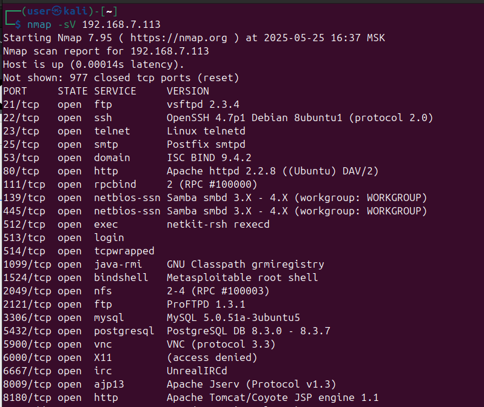

# Домашнее задание к занятию «Уязвимости и атаки на информационные системы» - Бетко Алексей

### Задание 1

Скачайте и установите виртуальную машину Metasploitable: https://sourceforge.net/projects/metasploitable/.

Это типовая ОС для экспериментов в области информационной безопасности, с которой следует начать при анализе уязвимостей.

Просканируйте эту виртуальную машину, используя **nmap**.

Попробуйте найти уязвимости, которым подвержена эта виртуальная машина.

Сами уязвимости можно поискать на сайте https://www.exploit-db.com/.

Для этого нужно в поиске ввести название сетевой службы, обнаруженной на атакуемой машине, и выбрать подходящие по версии уязвимости.

Ответьте на следующие вопросы:

- Какие сетевые службы в ней разрешены?
- Какие уязвимости были вами обнаружены? (список со ссылками: достаточно трёх уязвимостей)
  
### Ответ
1. Какие сетевые службы в ней разрешены?


2. Какие уязвимости были вами обнаружены?
<br>
<details>
  <summary>Результат сканирования</summary>

```shell
Starting Nmap 7.95 ( https://nmap.org ) at 2025-05-25 18:50 MSK
Nmap scan report for 192.168.7.113
Host is up (0.00012s latency).
Not shown: 977 closed tcp ports (reset)
PORT     STATE SERVICE     VERSION
21/tcp   open  ftp         vsftpd 2.3.4
| vulners: 
|   vsftpd 2.3.4: 
|     	PACKETSTORM:162145	10.0	https://vulners.com/packetstorm/PACKETSTORM:162145	*EXPLOIT*
|     	EDB-ID:49757	9.8	https://vulners.com/exploitdb/EDB-ID:49757	*EXPLOIT*
|     	CVE-2011-2523	9.8	https://vulners.com/cve/CVE-2011-2523
|_    	1337DAY-ID-36095	9.8	https://vulners.com/zdt/1337DAY-ID-36095	*EXPLOIT*
22/tcp   open  ssh         OpenSSH 4.7p1 Debian 8ubuntu1 (protocol 2.0)
| vulners: 
|   cpe:/a:openbsd:openssh:4.7p1: 
|     	CVE-2023-38408	9.8	https://vulners.com/cve/CVE-2023-38408
|     	CVE-2016-1908	9.8	https://vulners.com/cve/CVE-2016-1908
|     	B8190CDB-3EB9-5631-9828-8064A1575B23	9.8	https://vulners.com/githubexploit/B8190CDB-3EB9-5631-9828-8064A1575B23	*EXPLOIT*
|     	8FC9C5AB-3968-5F3C-825E-E8DB5379A623	9.8	https://vulners.com/githubexploit/8FC9C5AB-3968-5F3C-825E-E8DB5379A623	*EXPLOIT*
|     	8AD01159-548E-546E-AA87-2DE89F3927EC	9.8	https://vulners.com/githubexploit/8AD01159-548E-546E-AA87-2DE89F3927EC	*EXPLOIT*
|     	5E6968B4-DBD6-57FA-BF6E-D9B2219DB27A	9.8	https://vulners.com/githubexploit/5E6968B4-DBD6-57FA-BF6E-D9B2219DB27A	*EXPLOIT*
|     	2227729D-6700-5C8F-8930-1EEAFD4B9FF0	9.8	https://vulners.com/githubexploit/2227729D-6700-5C8F-8930-1EEAFD4B9FF0	*EXPLOIT*
|     	0221525F-07F5-5790-912D-F4B9E2D1B587	9.8	https://vulners.com/githubexploit/0221525F-07F5-5790-912D-F4B9E2D1B587	*EXPLOIT*
|     	CVE-2015-5600	8.5	https://vulners.com/cve/CVE-2015-5600
|     	SSV:78173	7.8	https://vulners.com/seebug/SSV:78173	*EXPLOIT*
|     	SSV:69983	7.8	https://vulners.com/seebug/SSV:69983	*EXPLOIT*
|     	PACKETSTORM:98796	7.8	https://vulners.com/packetstorm/PACKETSTORM:98796	*EXPLOIT*
|     	PACKETSTORM:94556	7.8	https://vulners.com/packetstorm/PACKETSTORM:94556	*EXPLOIT*
|     	PACKETSTORM:140070	7.8	https://vulners.com/packetstorm/PACKETSTORM:140070	*EXPLOIT*
|     	PACKETSTORM:101052	7.8	https://vulners.com/packetstorm/PACKETSTORM:101052	*EXPLOIT*
|     	EXPLOITPACK:71D51B69AA2D3A74753D7A921EE79985	7.8	https://vulners.com/exploitpack/EXPLOITPACK:71D51B69AA2D3A74753D7A921EE79985	*EXPLOIT*
|     	EXPLOITPACK:67F6569F63A082199721C069C852BBD7	7.8	https://vulners.com/exploitpack/EXPLOITPACK:67F6569F63A082199721C069C852BBD7	*EXPLOIT*
|     	EXPLOITPACK:5BCA798C6BA71FAE29334297EC0B6A09	7.8	https://vulners.com/exploitpack/EXPLOITPACK:5BCA798C6BA71FAE29334297EC0B6A09	*EXPLOIT*
|     	EDB-ID:24450	7.8	https://vulners.com/exploitdb/EDB-ID:24450	*EXPLOIT*
|     	EDB-ID:15215	7.8	https://vulners.com/exploitdb/EDB-ID:15215	*EXPLOIT*
|     	CVE-2020-15778	7.8	https://vulners.com/cve/CVE-2020-15778
|     	CVE-2016-10012	7.8	https://vulners.com/cve/CVE-2016-10012
|     	CVE-2015-8325	7.8	https://vulners.com/cve/CVE-2015-8325
|     	1337DAY-ID-26494	7.8	https://vulners.com/zdt/1337DAY-ID-26494	*EXPLOIT*
|     	SSV:92579	7.5	https://vulners.com/seebug/SSV:92579	*EXPLOIT*
|     	SSV:61450	7.5	https://vulners.com/seebug/SSV:61450	*EXPLOIT*
|     	PACKETSTORM:173661	7.5	https://vulners.com/packetstorm/PACKETSTORM:173661	*EXPLOIT*
|     	F0979183-AE88-53B4-86CF-3AF0523F3807	7.5	https://vulners.com/githubexploit/F0979183-AE88-53B4-86CF-3AF0523F3807	*EXPLOIT*
|     	EDB-ID:40888	7.5	https://vulners.com/exploitdb/EDB-ID:40888	*EXPLOIT*
|     	CVE-2016-6515	7.5	https://vulners.com/cve/CVE-2016-6515
|     	CVE-2016-10708	7.5	https://vulners.com/cve/CVE-2016-10708
|     	CVE-2014-1692	7.5	https://vulners.com/cve/CVE-2014-1692
|     	CVE-2010-4478	7.5	https://vulners.com/cve/CVE-2010-4478
|     	1337DAY-ID-26576	7.5	https://vulners.com/zdt/1337DAY-ID-26576	*EXPLOIT*
|     	CVE-2016-10009	7.3	https://vulners.com/cve/CVE-2016-10009
|     	SSV:92582	7.2	https://vulners.com/seebug/SSV:92582	*EXPLOIT*
|     	CVE-2016-10010	7.0	https://vulners.com/cve/CVE-2016-10010
|     	SSV:92580	6.9	https://vulners.com/seebug/SSV:92580	*EXPLOIT*
|     	CVE-2015-6564	6.9	https://vulners.com/cve/CVE-2015-6564
|     	95499236-C9FE-56A6-9D7D-E943A24B633A	6.9	https://vulners.com/githubexploit/95499236-C9FE-56A6-9D7D-E943A24B633A	*EXPLOIT*
|     	2C119FFA-ECE0-5E14-A4A4-354A2C38071A	6.9	https://vulners.com/githubexploit/2C119FFA-ECE0-5E14-A4A4-354A2C38071A	*EXPLOIT*
|     	1337DAY-ID-26577	6.9	https://vulners.com/zdt/1337DAY-ID-26577	*EXPLOIT*
|     	EDB-ID:46516	6.8	https://vulners.com/exploitdb/EDB-ID:46516	*EXPLOIT*
|     	EDB-ID:46193	6.8	https://vulners.com/exploitdb/EDB-ID:46193	*EXPLOIT*
|     	CVE-2019-6110	6.8	https://vulners.com/cve/CVE-2019-6110
|     	CVE-2019-6109	6.8	https://vulners.com/cve/CVE-2019-6109
|     	C94132FD-1FA5-5342-B6EE-0DAF45EEFFE3	6.8	https://vulners.com/githubexploit/C94132FD-1FA5-5342-B6EE-0DAF45EEFFE3	*EXPLOIT*
|     	10213DBE-F683-58BB-B6D3-353173626207	6.8	https://vulners.com/githubexploit/10213DBE-F683-58BB-B6D3-353173626207	*EXPLOIT*
|     	CVE-2023-51385	6.5	https://vulners.com/cve/CVE-2023-51385
|     	CVE-2008-1657	6.5	https://vulners.com/cve/CVE-2008-1657
|     	EDB-ID:40858	6.4	https://vulners.com/exploitdb/EDB-ID:40858	*EXPLOIT*
|     	EDB-ID:40119	6.4	https://vulners.com/exploitdb/EDB-ID:40119	*EXPLOIT*
|     	EDB-ID:39569	6.4	https://vulners.com/exploitdb/EDB-ID:39569	*EXPLOIT*
|     	CVE-2016-3115	6.4	https://vulners.com/cve/CVE-2016-3115
|     	PACKETSTORM:181223	5.9	https://vulners.com/packetstorm/PACKETSTORM:181223	*EXPLOIT*
|     	MSF:AUXILIARY-SCANNER-SSH-SSH_ENUMUSERS-	5.9	https://vulners.com/metasploit/MSF:AUXILIARY-SCANNER-SSH-SSH_ENUMUSERS-	*EXPLOIT*
|     	EDB-ID:40136	5.9	https://vulners.com/exploitdb/EDB-ID:40136	*EXPLOIT*
|     	EDB-ID:40113	5.9	https://vulners.com/exploitdb/EDB-ID:40113	*EXPLOIT*
|     	CVE-2023-48795	5.9	https://vulners.com/cve/CVE-2023-48795
|     	CVE-2019-6111	5.9	https://vulners.com/cve/CVE-2019-6111
|     	CVE-2016-6210	5.9	https://vulners.com/cve/CVE-2016-6210
|     	CC3AE4FC-CF04-5EDA-A010-6D7E71538C92	5.9	https://vulners.com/githubexploit/CC3AE4FC-CF04-5EDA-A010-6D7E71538C92	*EXPLOIT*
|     	54E1BB01-2C69-5AFD-A23D-9783C9D9FC4C	5.9	https://vulners.com/githubexploit/54E1BB01-2C69-5AFD-A23D-9783C9D9FC4C	*EXPLOIT*
|     	SSV:61911	5.8	https://vulners.com/seebug/SSV:61911	*EXPLOIT*
|     	EXPLOITPACK:98FE96309F9524B8C84C508837551A19	5.8	https://vulners.com/exploitpack/EXPLOITPACK:98FE96309F9524B8C84C508837551A19	*EXPLOIT*
|     	EXPLOITPACK:5330EA02EBDE345BFC9D6DDDD97F9E97	5.8	https://vulners.com/exploitpack/EXPLOITPACK:5330EA02EBDE345BFC9D6DDDD97F9E97	*EXPLOIT*
|     	CVE-2014-2653	5.8	https://vulners.com/cve/CVE-2014-2653
|     	1337DAY-ID-32328	5.8	https://vulners.com/zdt/1337DAY-ID-32328	*EXPLOIT*
|     	1337DAY-ID-32009	5.8	https://vulners.com/zdt/1337DAY-ID-32009	*EXPLOIT*
|     	SSV:91041	5.5	https://vulners.com/seebug/SSV:91041	*EXPLOIT*
|     	PACKETSTORM:140019	5.5	https://vulners.com/packetstorm/PACKETSTORM:140019	*EXPLOIT*
|     	PACKETSTORM:136251	5.5	https://vulners.com/packetstorm/PACKETSTORM:136251	*EXPLOIT*
|     	PACKETSTORM:136234	5.5	https://vulners.com/packetstorm/PACKETSTORM:136234	*EXPLOIT*
|     	EXPLOITPACK:F92411A645D85F05BDBD274FD222226F	5.5	https://vulners.com/exploitpack/EXPLOITPACK:F92411A645D85F05BDBD274FD222226F	*EXPLOIT*
|     	EXPLOITPACK:9F2E746846C3C623A27A441281EAD138	5.5	https://vulners.com/exploitpack/EXPLOITPACK:9F2E746846C3C623A27A441281EAD138	*EXPLOIT*
|     	EXPLOITPACK:1902C998CBF9154396911926B4C3B330	5.5	https://vulners.com/exploitpack/EXPLOITPACK:1902C998CBF9154396911926B4C3B330	*EXPLOIT*
|     	CVE-2016-10011	5.5	https://vulners.com/cve/CVE-2016-10011
|     	1337DAY-ID-25388	5.5	https://vulners.com/zdt/1337DAY-ID-25388	*EXPLOIT*
|     	EDB-ID:45939	5.3	https://vulners.com/exploitdb/EDB-ID:45939	*EXPLOIT*
|     	EDB-ID:45233	5.3	https://vulners.com/exploitdb/EDB-ID:45233	*EXPLOIT*
|     	CVE-2018-20685	5.3	https://vulners.com/cve/CVE-2018-20685
|     	CVE-2018-15473	5.3	https://vulners.com/cve/CVE-2018-15473
|     	CVE-2017-15906	5.3	https://vulners.com/cve/CVE-2017-15906
|     	CVE-2016-20012	5.3	https://vulners.com/cve/CVE-2016-20012
|     	SSV:60656	5.0	https://vulners.com/seebug/SSV:60656	*EXPLOIT*
|     	SSH_ENUM	5.0	https://vulners.com/canvas/SSH_ENUM	*EXPLOIT*
|     	PACKETSTORM:150621	5.0	https://vulners.com/packetstorm/PACKETSTORM:150621	*EXPLOIT*
|     	EXPLOITPACK:F957D7E8A0CC1E23C3C649B764E13FB0	5.0	https://vulners.com/exploitpack/EXPLOITPACK:F957D7E8A0CC1E23C3C649B764E13FB0	*EXPLOIT*
|     	EXPLOITPACK:EBDBC5685E3276D648B4D14B75563283	5.0	https://vulners.com/exploitpack/EXPLOITPACK:EBDBC5685E3276D648B4D14B75563283	*EXPLOIT*
|     	CVE-2010-5107	5.0	https://vulners.com/cve/CVE-2010-5107
|     	1337DAY-ID-31730	5.0	https://vulners.com/zdt/1337DAY-ID-31730	*EXPLOIT*
|     	CVE-2014-2532	4.9	https://vulners.com/cve/CVE-2014-2532
|     	EXPLOITPACK:802AF3229492E147A5F09C7F2B27C6DF	4.3	https://vulners.com/exploitpack/EXPLOITPACK:802AF3229492E147A5F09C7F2B27C6DF	*EXPLOIT*
|     	EXPLOITPACK:5652DDAA7FE452E19AC0DC1CD97BA3EF	4.3	https://vulners.com/exploitpack/EXPLOITPACK:5652DDAA7FE452E19AC0DC1CD97BA3EF	*EXPLOIT*
|     	CVE-2015-5352	4.3	https://vulners.com/cve/CVE-2015-5352
|     	1337DAY-ID-25440	4.3	https://vulners.com/zdt/1337DAY-ID-25440	*EXPLOIT*
|     	1337DAY-ID-25438	4.3	https://vulners.com/zdt/1337DAY-ID-25438	*EXPLOIT*
|     	CVE-2010-4755	4.0	https://vulners.com/cve/CVE-2010-4755
|     	CVE-2021-36368	3.7	https://vulners.com/cve/CVE-2021-36368
|     	CVE-2012-0814	3.5	https://vulners.com/cve/CVE-2012-0814
|     	CVE-2011-5000	3.5	https://vulners.com/cve/CVE-2011-5000
|     	SSV:92581	2.1	https://vulners.com/seebug/SSV:92581	*EXPLOIT*
|     	CVE-2011-4327	2.1	https://vulners.com/cve/CVE-2011-4327
|     	CVE-2015-6563	1.9	https://vulners.com/cve/CVE-2015-6563
|     	CVE-2008-3259	1.2	https://vulners.com/cve/CVE-2008-3259
|     	PACKETSTORM:151227	0.0	https://vulners.com/packetstorm/PACKETSTORM:151227	*EXPLOIT*
|     	PACKETSTORM:140261	0.0	https://vulners.com/packetstorm/PACKETSTORM:140261	*EXPLOIT*
|     	PACKETSTORM:138006	0.0	https://vulners.com/packetstorm/PACKETSTORM:138006	*EXPLOIT*
|     	PACKETSTORM:137942	0.0	https://vulners.com/packetstorm/PACKETSTORM:137942	*EXPLOIT*
|     	1337DAY-ID-30937	0.0	https://vulners.com/zdt/1337DAY-ID-30937	*EXPLOIT*
|     	1337DAY-ID-26468	0.0	https://vulners.com/zdt/1337DAY-ID-26468	*EXPLOIT*
|     	1337DAY-ID-25391	0.0	https://vulners.com/zdt/1337DAY-ID-25391	*EXPLOIT*
|     	1337DAY-ID-20301	0.0	https://vulners.com/zdt/1337DAY-ID-20301	*EXPLOIT*
|_    	1337DAY-ID-14373	0.0	https://vulners.com/zdt/1337DAY-ID-14373	*EXPLOIT*
23/tcp   open  telnet      Linux telnetd
25/tcp   open  smtp        Postfix smtpd
53/tcp   open  domain      ISC BIND 9.4.2
| vulners: 
|   cpe:/a:isc:bind:9.4.2: 
|     	SSV:2853	10.0	https://vulners.com/seebug/SSV:2853	*EXPLOIT*
|     	CVE-2008-0122	10.0	https://vulners.com/cve/CVE-2008-0122
|     	CVE-2021-25216	9.8	https://vulners.com/cve/CVE-2021-25216
|     	CVE-2020-8616	8.6	https://vulners.com/cve/CVE-2020-8616
|     	CVE-2016-1286	8.6	https://vulners.com/cve/CVE-2016-1286
|     	SSV:60184	8.5	https://vulners.com/seebug/SSV:60184	*EXPLOIT*
|     	CVE-2012-1667	8.5	https://vulners.com/cve/CVE-2012-1667
|     	SSV:60292	7.8	https://vulners.com/seebug/SSV:60292	*EXPLOIT*
|     	PACKETSTORM:180552	7.8	https://vulners.com/packetstorm/PACKETSTORM:180552	*EXPLOIT*
|     	PACKETSTORM:138960	7.8	https://vulners.com/packetstorm/PACKETSTORM:138960	*EXPLOIT*
|     	PACKETSTORM:132926	7.8	https://vulners.com/packetstorm/PACKETSTORM:132926	*EXPLOIT*
|     	MSF:AUXILIARY-DOS-DNS-BIND_TKEY-	7.8	https://vulners.com/metasploit/MSF:AUXILIARY-DOS-DNS-BIND_TKEY-	*EXPLOIT*
|     	EXPLOITPACK:BE4F638B632EA0754155A27ECC4B3D3F	7.8	https://vulners.com/exploitpack/EXPLOITPACK:BE4F638B632EA0754155A27ECC4B3D3F	*EXPLOIT*
|     	EXPLOITPACK:46DEBFAC850194C04C54F93E0DFF5F4F	7.8	https://vulners.com/exploitpack/EXPLOITPACK:46DEBFAC850194C04C54F93E0DFF5F4F	*EXPLOIT*
|     	EXPLOITPACK:09762DB0197BBAAAB6FC79F24F0D2A74	7.8	https://vulners.com/exploitpack/EXPLOITPACK:09762DB0197BBAAAB6FC79F24F0D2A74	*EXPLOIT*
|     	EDB-ID:42121	7.8	https://vulners.com/exploitdb/EDB-ID:42121	*EXPLOIT*
|     	EDB-ID:37723	7.8	https://vulners.com/exploitdb/EDB-ID:37723	*EXPLOIT*
|     	EDB-ID:37721	7.8	https://vulners.com/exploitdb/EDB-ID:37721	*EXPLOIT*
|     	CVE-2017-3141	7.8	https://vulners.com/cve/CVE-2017-3141
|     	CVE-2015-5722	7.8	https://vulners.com/cve/CVE-2015-5722
|     	CVE-2015-5477	7.8	https://vulners.com/cve/CVE-2015-5477
|     	CVE-2014-8500	7.8	https://vulners.com/cve/CVE-2014-8500
|     	CVE-2012-5166	7.8	https://vulners.com/cve/CVE-2012-5166
|     	CVE-2012-4244	7.8	https://vulners.com/cve/CVE-2012-4244
|     	CVE-2012-3817	7.8	https://vulners.com/cve/CVE-2012-3817
|     	CVE-2008-4163	7.8	https://vulners.com/cve/CVE-2008-4163
|     	1337DAY-ID-25325	7.8	https://vulners.com/zdt/1337DAY-ID-25325	*EXPLOIT*
|     	1337DAY-ID-23970	7.8	https://vulners.com/zdt/1337DAY-ID-23970	*EXPLOIT*
|     	1337DAY-ID-23960	7.8	https://vulners.com/zdt/1337DAY-ID-23960	*EXPLOIT*
|     	1337DAY-ID-23948	7.8	https://vulners.com/zdt/1337DAY-ID-23948	*EXPLOIT*
|     	CVE-2010-0382	7.6	https://vulners.com/cve/CVE-2010-0382
|     	PACKETSTORM:180551	7.5	https://vulners.com/packetstorm/PACKETSTORM:180551	*EXPLOIT*
|     	MSF:AUXILIARY-DOS-DNS-BIND_TSIG_BADTIME-	7.5	https://vulners.com/metasploit/MSF:AUXILIARY-DOS-DNS-BIND_TSIG_BADTIME-	*EXPLOIT*
|     	MSF:AUXILIARY-DOS-DNS-BIND_TSIG-	7.5	https://vulners.com/metasploit/MSF:AUXILIARY-DOS-DNS-BIND_TSIG-	*EXPLOIT*
|     	EDB-ID:40453	7.5	https://vulners.com/exploitdb/EDB-ID:40453	*EXPLOIT*
|     	CVE-2023-50387	7.5	https://vulners.com/cve/CVE-2023-50387
|     	CVE-2023-4408	7.5	https://vulners.com/cve/CVE-2023-4408
|     	CVE-2023-3341	7.5	https://vulners.com/cve/CVE-2023-3341
|     	CVE-2021-25215	7.5	https://vulners.com/cve/CVE-2021-25215
|     	CVE-2020-8617	7.5	https://vulners.com/cve/CVE-2020-8617
|     	CVE-2017-3145	7.5	https://vulners.com/cve/CVE-2017-3145
|     	CVE-2017-3143	7.5	https://vulners.com/cve/CVE-2017-3143
|     	CVE-2016-9444	7.5	https://vulners.com/cve/CVE-2016-9444
|     	CVE-2016-9131	7.5	https://vulners.com/cve/CVE-2016-9131
|     	CVE-2016-8864	7.5	https://vulners.com/cve/CVE-2016-8864
|     	CVE-2016-2848	7.5	https://vulners.com/cve/CVE-2016-2848
|     	CVE-2016-2776	7.5	https://vulners.com/cve/CVE-2016-2776
|     	CVE-2009-0265	7.5	https://vulners.com/cve/CVE-2009-0265
|     	CE8366BE-F17D-552A-B1B4-C2DBD31482C0	7.5	https://vulners.com/githubexploit/CE8366BE-F17D-552A-B1B4-C2DBD31482C0	*EXPLOIT*
|     	BB688FBF-CEE2-5DD1-8561-8F76501DE2D4	7.5	https://vulners.com/githubexploit/BB688FBF-CEE2-5DD1-8561-8F76501DE2D4	*EXPLOIT*
|     	5EFDF373-FBD1-5C09-A612-00ADBFE574CF	7.5	https://vulners.com/githubexploit/5EFDF373-FBD1-5C09-A612-00ADBFE574CF	*EXPLOIT*
|     	1337DAY-ID-34485	7.5	https://vulners.com/zdt/1337DAY-ID-34485	*EXPLOIT*
|     	EXPLOITPACK:D6DDF5E24DE171DAAD71FD95FC1B67F2	7.2	https://vulners.com/exploitpack/EXPLOITPACK:D6DDF5E24DE171DAAD71FD95FC1B67F2	*EXPLOIT*
|     	CVE-2015-8461	7.1	https://vulners.com/cve/CVE-2015-8461
|     	CVE-2015-5986	7.1	https://vulners.com/cve/CVE-2015-5986
|     	CVE-2015-8705	7.0	https://vulners.com/cve/CVE-2015-8705
|     	CVE-2016-1285	6.8	https://vulners.com/cve/CVE-2016-1285
|     	CVE-2009-0025	6.8	https://vulners.com/cve/CVE-2009-0025
|     	CVE-2020-8622	6.5	https://vulners.com/cve/CVE-2020-8622
|     	CVE-2018-5741	6.5	https://vulners.com/cve/CVE-2018-5741
|     	CVE-2016-6170	6.5	https://vulners.com/cve/CVE-2016-6170
|     	CVE-2015-8704	6.5	https://vulners.com/cve/CVE-2015-8704
|     	CVE-2010-3614	6.4	https://vulners.com/cve/CVE-2010-3614
|     	PACKETSTORM:180550	5.9	https://vulners.com/packetstorm/PACKETSTORM:180550	*EXPLOIT*
|     	CVE-2016-2775	5.9	https://vulners.com/cve/CVE-2016-2775
|     	SSV:4636	5.8	https://vulners.com/seebug/SSV:4636	*EXPLOIT*
|     	CVE-2022-2795	5.3	https://vulners.com/cve/CVE-2022-2795
|     	CVE-2021-25219	5.3	https://vulners.com/cve/CVE-2021-25219
|     	CVE-2017-3142	5.3	https://vulners.com/cve/CVE-2017-3142
|     	SSV:30099	5.0	https://vulners.com/seebug/SSV:30099	*EXPLOIT*
|     	SSV:20595	5.0	https://vulners.com/seebug/SSV:20595	*EXPLOIT*
|     	PACKETSTORM:157836	5.0	https://vulners.com/packetstorm/PACKETSTORM:157836	*EXPLOIT*
|     	FBC03933-7A65-52F3-83F4-4B2253A490B6	5.0	https://vulners.com/githubexploit/FBC03933-7A65-52F3-83F4-4B2253A490B6	*EXPLOIT*
|     	CVE-2015-8000	5.0	https://vulners.com/cve/CVE-2015-8000
|     	CVE-2012-1033	5.0	https://vulners.com/cve/CVE-2012-1033
|     	CVE-2011-4313	5.0	https://vulners.com/cve/CVE-2011-4313
|     	CVE-2011-1910	5.0	https://vulners.com/cve/CVE-2011-1910
|     	SSV:11919	4.3	https://vulners.com/seebug/SSV:11919	*EXPLOIT*
|     	CVE-2010-3762	4.3	https://vulners.com/cve/CVE-2010-3762
|     	CVE-2010-0097	4.3	https://vulners.com/cve/CVE-2010-0097
|     	CVE-2009-0696	4.3	https://vulners.com/cve/CVE-2009-0696
|     	CVE-2010-0290	4.0	https://vulners.com/cve/CVE-2010-0290
|     	SSV:14986	2.6	https://vulners.com/seebug/SSV:14986	*EXPLOIT*
|     	CVE-2009-4022	2.6	https://vulners.com/cve/CVE-2009-4022
|     	PACKETSTORM:142800	0.0	https://vulners.com/packetstorm/PACKETSTORM:142800	*EXPLOIT*
|_    	1337DAY-ID-27896	0.0	https://vulners.com/zdt/1337DAY-ID-27896	*EXPLOIT*
80/tcp   open  http        Apache httpd 2.2.8 ((Ubuntu) DAV/2)
|_http-server-header: Apache/2.2.8 (Ubuntu) DAV/2
| vulners: 
|   cpe:/a:apache:http_server:2.2.8: 
|     	SSV:69341	10.0	https://vulners.com/seebug/SSV:69341	*EXPLOIT*
|     	SSV:19282	10.0	https://vulners.com/seebug/SSV:19282	*EXPLOIT*
|     	SSV:19236	10.0	https://vulners.com/seebug/SSV:19236	*EXPLOIT*
|     	SSV:11999	10.0	https://vulners.com/seebug/SSV:11999	*EXPLOIT*
|     	PACKETSTORM:86964	10.0	https://vulners.com/packetstorm/PACKETSTORM:86964	*EXPLOIT*
|     	PACKETSTORM:180533	10.0	https://vulners.com/packetstorm/PACKETSTORM:180533	*EXPLOIT*
|     	MSF:AUXILIARY-DOS-HTTP-APACHE_MOD_ISAPI-	10.0	https://vulners.com/metasploit/MSF:AUXILIARY-DOS-HTTP-APACHE_MOD_ISAPI-	*EXPLOIT*
|     	HTTPD:E74B6F3660D13C4DD05DF3A83EA61631	10.0	https://vulners.com/httpd/HTTPD:E74B6F3660D13C4DD05DF3A83EA61631
|     	HTTPD:81180E4E634CDECC9784146016B4A949	10.0	https://vulners.com/httpd/HTTPD:81180E4E634CDECC9784146016B4A949
|     	EXPLOITPACK:30ED468EC8BD5B71B2CB93825A852B80	10.0	https://vulners.com/exploitpack/EXPLOITPACK:30ED468EC8BD5B71B2CB93825A852B80	*EXPLOIT*
|     	EDB-ID:14288	10.0	https://vulners.com/exploitdb/EDB-ID:14288	*EXPLOIT*
|     	EDB-ID:11650	10.0	https://vulners.com/exploitdb/EDB-ID:11650	*EXPLOIT*
|     	CVE-2010-0425	10.0	https://vulners.com/cve/CVE-2010-0425
|     	C94CBDE1-4CC5-5C06-9D18-23CAB216705E	10.0	https://vulners.com/githubexploit/C94CBDE1-4CC5-5C06-9D18-23CAB216705E	*EXPLOIT*
|     	PACKETSTORM:181114	9.8	https://vulners.com/packetstorm/PACKETSTORM:181114	*EXPLOIT*
|     	MSF:EXPLOIT-MULTI-HTTP-APACHE_NORMALIZE_PATH_RCE-	9.8	https://vulners.com/metasploit/MSF:EXPLOIT-MULTI-HTTP-APACHE_NORMALIZE_PATH_RCE-	*EXPLOIT*
|     	MSF:AUXILIARY-SCANNER-HTTP-APACHE_NORMALIZE_PATH-	9.8	https://vulners.com/metasploit/MSF:AUXILIARY-SCANNER-HTTP-APACHE_NORMALIZE_PATH-	*EXPLOIT*
|     	HTTPD:E69E9574251973D5AF93FA9D04997FC1	9.8	https://vulners.com/httpd/HTTPD:E69E9574251973D5AF93FA9D04997FC1
|     	HTTPD:E162D3AE025639FEE2A89D5AF40ABF2F	9.8	https://vulners.com/httpd/HTTPD:E162D3AE025639FEE2A89D5AF40ABF2F
|     	HTTPD:C072933AA965A86DA3E2C9172FFC1569	9.8	https://vulners.com/httpd/HTTPD:C072933AA965A86DA3E2C9172FFC1569
|     	HTTPD:A1BBCE110E077FFBF4469D4F06DB9293	9.8	https://vulners.com/httpd/HTTPD:A1BBCE110E077FFBF4469D4F06DB9293
|     	HTTPD:A09F9CEBE0B7C39EDA0480FEAEF4FE9D	9.8	https://vulners.com/httpd/HTTPD:A09F9CEBE0B7C39EDA0480FEAEF4FE9D
|     	HTTPD:9F5406E0F4A0B007A0A4C9C92EF9813B	9.8	https://vulners.com/httpd/HTTPD:9F5406E0F4A0B007A0A4C9C92EF9813B
|     	HTTPD:9BCBE3C14201AFC4B0F36F15CB40C0F8	9.8	https://vulners.com/httpd/HTTPD:9BCBE3C14201AFC4B0F36F15CB40C0F8
|     	HTTPD:2BE0032A6ABE7CC52906DBAAFE0E448E	9.8	https://vulners.com/httpd/HTTPD:2BE0032A6ABE7CC52906DBAAFE0E448E
|     	F9C0CD4B-3B60-5720-AE7A-7CC31DB839C5	9.8	https://vulners.com/githubexploit/F9C0CD4B-3B60-5720-AE7A-7CC31DB839C5	*EXPLOIT*
|     	F41EE867-4E63-5259-9DF0-745881884D04	9.8	https://vulners.com/githubexploit/F41EE867-4E63-5259-9DF0-745881884D04	*EXPLOIT*
|     	EDB-ID:51193	9.8	https://vulners.com/exploitdb/EDB-ID:51193	*EXPLOIT*
|     	EDB-ID:50512	9.8	https://vulners.com/exploitdb/EDB-ID:50512	*EXPLOIT*
|     	EDB-ID:50446	9.8	https://vulners.com/exploitdb/EDB-ID:50446	*EXPLOIT*
|     	EDB-ID:50406	9.8	https://vulners.com/exploitdb/EDB-ID:50406	*EXPLOIT*
|     	E796A40A-8A8E-59D1-93FB-78EF4D8B7FA6	9.8	https://vulners.com/githubexploit/E796A40A-8A8E-59D1-93FB-78EF4D8B7FA6	*EXPLOIT*
|     	D5084D51-C8DF-5CBA-BC26-ACF2E33F8E52	9.8	https://vulners.com/githubexploit/D5084D51-C8DF-5CBA-BC26-ACF2E33F8E52	*EXPLOIT*
|     	D10426F3-DF82-5439-AC3E-6CA0A1365A09	9.8	https://vulners.com/githubexploit/D10426F3-DF82-5439-AC3E-6CA0A1365A09	*EXPLOIT*
|     	D0368327-F989-5557-A5C6-0D9ACDB4E72F	9.8	https://vulners.com/githubexploit/D0368327-F989-5557-A5C6-0D9ACDB4E72F	*EXPLOIT*
|     	CVE-2024-38476	9.8	https://vulners.com/cve/CVE-2024-38476
|     	CVE-2022-31813	9.8	https://vulners.com/cve/CVE-2022-31813
|     	CVE-2022-22720	9.8	https://vulners.com/cve/CVE-2022-22720
|     	CVE-2021-44790	9.8	https://vulners.com/cve/CVE-2021-44790
|     	CVE-2021-42013	9.8	https://vulners.com/cve/CVE-2021-42013
|     	CVE-2021-39275	9.8	https://vulners.com/cve/CVE-2021-39275
|     	CVE-2021-26691	9.8	https://vulners.com/cve/CVE-2021-26691
|     	CVE-2018-1312	9.8	https://vulners.com/cve/CVE-2018-1312
|     	CVE-2017-7679	9.8	https://vulners.com/cve/CVE-2017-7679
|     	CVE-2017-3169	9.8	https://vulners.com/cve/CVE-2017-3169
|     	CVE-2017-3167	9.8	https://vulners.com/cve/CVE-2017-3167
|     	CNVD-2022-51061	9.8	https://vulners.com/cnvd/CNVD-2022-51061
|     	CNVD-2022-03225	9.8	https://vulners.com/cnvd/CNVD-2022-03225
|     	CNVD-2021-102386	9.8	https://vulners.com/cnvd/CNVD-2021-102386
|     	CC15AE65-B697-525A-AF4B-38B1501CAB49	9.8	https://vulners.com/githubexploit/CC15AE65-B697-525A-AF4B-38B1501CAB49	*EXPLOIT*
|     	C879EE66-6B75-5EC8-AA68-08693C6CCAD1	9.8	https://vulners.com/githubexploit/C879EE66-6B75-5EC8-AA68-08693C6CCAD1	*EXPLOIT*
|     	C5A61CC6-919E-58B4-8FBB-0198654A7FC8	9.8	https://vulners.com/githubexploit/C5A61CC6-919E-58B4-8FBB-0198654A7FC8	*EXPLOIT*
|     	BF9B0898-784E-5B5E-9505-430B58C1E6B8	9.8	https://vulners.com/githubexploit/BF9B0898-784E-5B5E-9505-430B58C1E6B8	*EXPLOIT*
|     	B02819DB-1481-56C4-BD09-6B4574297109	9.8	https://vulners.com/githubexploit/B02819DB-1481-56C4-BD09-6B4574297109	*EXPLOIT*
|     	ACD5A7F2-FDB2-5859-8D23-3266A1AF6795	9.8	https://vulners.com/githubexploit/ACD5A7F2-FDB2-5859-8D23-3266A1AF6795	*EXPLOIT*
|     	A90ABEAD-13A8-5F09-8A19-6D9D2D804F05	9.8	https://vulners.com/githubexploit/A90ABEAD-13A8-5F09-8A19-6D9D2D804F05	*EXPLOIT*
|     	A8616E5E-04F8-56D8-ACB4-32FDF7F66EED	9.8	https://vulners.com/githubexploit/A8616E5E-04F8-56D8-ACB4-32FDF7F66EED	*EXPLOIT*
|     	A5425A79-9D81-513A-9CC5-549D6321897C	9.8	https://vulners.com/githubexploit/A5425A79-9D81-513A-9CC5-549D6321897C	*EXPLOIT*
|     	A2D97DCC-04C2-5CB1-921F-709AA8D7FD9A	9.8	https://vulners.com/githubexploit/A2D97DCC-04C2-5CB1-921F-709AA8D7FD9A	*EXPLOIT*
|     	9B4F4E4A-CFDF-5847-805F-C0BAE809DBD5	9.8	https://vulners.com/githubexploit/9B4F4E4A-CFDF-5847-805F-C0BAE809DBD5	*EXPLOIT*
|     	907F28D0-5906-51C7-BAA3-FEBD5E878801	9.8	https://vulners.com/githubexploit/907F28D0-5906-51C7-BAA3-FEBD5E878801	*EXPLOIT*
|     	8A57FAF6-FC91-52D1-84E0-4CBBAD3F9677	9.8	https://vulners.com/githubexploit/8A57FAF6-FC91-52D1-84E0-4CBBAD3F9677	*EXPLOIT*
|     	88EB009A-EEFF-52B7-811D-A8A8C8DE8C81	9.8	https://vulners.com/githubexploit/88EB009A-EEFF-52B7-811D-A8A8C8DE8C81	*EXPLOIT*
|     	8713FD59-264B-5FD7-8429-3251AB5AB3B8	9.8	https://vulners.com/githubexploit/8713FD59-264B-5FD7-8429-3251AB5AB3B8	*EXPLOIT*
|     	866E26E3-759B-526D-ABB5-206B2A1AC3EE	9.8	https://vulners.com/githubexploit/866E26E3-759B-526D-ABB5-206B2A1AC3EE	*EXPLOIT*
|     	86360765-0B1A-5D73-A805-BAE8F1B5D16D	9.8	https://vulners.com/githubexploit/86360765-0B1A-5D73-A805-BAE8F1B5D16D	*EXPLOIT*
|     	831E1114-13D1-54EF-BDE4-F655114CDC29	9.8	https://vulners.com/githubexploit/831E1114-13D1-54EF-BDE4-F655114CDC29	*EXPLOIT*
|     	805E6B24-8DF9-51D8-8DF6-6658161F96EA	9.8	https://vulners.com/githubexploit/805E6B24-8DF9-51D8-8DF6-6658161F96EA	*EXPLOIT*
|     	7E615961-3792-5896-94FA-1F9D494ACB36	9.8	https://vulners.com/githubexploit/7E615961-3792-5896-94FA-1F9D494ACB36	*EXPLOIT*
|     	78787F63-0356-51EC-B32A-B9BD114431C3	9.8	https://vulners.com/githubexploit/78787F63-0356-51EC-B32A-B9BD114431C3	*EXPLOIT*
|     	6CAA7558-723B-5286-9840-4DF4EB48E0AF	9.8	https://vulners.com/githubexploit/6CAA7558-723B-5286-9840-4DF4EB48E0AF	*EXPLOIT*
|     	6A0A657E-8300-5312-99CE-E11F460B1DBF	9.8	https://vulners.com/githubexploit/6A0A657E-8300-5312-99CE-E11F460B1DBF	*EXPLOIT*
|     	64D31BF1-F977-51EC-AB1C-6693CA6B58F3	9.8	https://vulners.com/githubexploit/64D31BF1-F977-51EC-AB1C-6693CA6B58F3	*EXPLOIT*
|     	61075B23-F713-537A-9B84-7EB9B96CF228	9.8	https://vulners.com/githubexploit/61075B23-F713-537A-9B84-7EB9B96CF228	*EXPLOIT*
|     	5312D04F-9490-5472-84FA-86B3BBDC8928	9.8	https://vulners.com/githubexploit/5312D04F-9490-5472-84FA-86B3BBDC8928	*EXPLOIT*
|     	52E13088-9643-5E81-B0A0-B7478BCF1F2C	9.8	https://vulners.com/githubexploit/52E13088-9643-5E81-B0A0-B7478BCF1F2C	*EXPLOIT*
|     	50453CEF-5DCF-511A-ADAC-FB74994CD682	9.8	https://vulners.com/githubexploit/50453CEF-5DCF-511A-ADAC-FB74994CD682	*EXPLOIT*
|     	495E99E5-C1B0-52C1-9218-384D04161BE4	9.8	https://vulners.com/githubexploit/495E99E5-C1B0-52C1-9218-384D04161BE4	*EXPLOIT*
|     	44E43BB7-6255-58E7-99C7-C3B84645D497	9.8	https://vulners.com/githubexploit/44E43BB7-6255-58E7-99C7-C3B84645D497	*EXPLOIT*
|     	40F21EB4-9EE8-5ED1-B561-0A2B8625EED3	9.8	https://vulners.com/githubexploit/40F21EB4-9EE8-5ED1-B561-0A2B8625EED3	*EXPLOIT*
|     	37634050-FDDF-571A-90BB-C8109824B38D	9.8	https://vulners.com/githubexploit/37634050-FDDF-571A-90BB-C8109824B38D	*EXPLOIT*
|     	30293CDA-FDB1-5FAF-9622-88427267F204	9.8	https://vulners.com/githubexploit/30293CDA-FDB1-5FAF-9622-88427267F204	*EXPLOIT*
|     	2B3110E1-BEA0-5DB8-93AD-1682230F3E19	9.8	https://vulners.com/githubexploit/2B3110E1-BEA0-5DB8-93AD-1682230F3E19	*EXPLOIT*
|     	22DCCD26-B68C-5905-BAC2-71D10DE3F123	9.8	https://vulners.com/githubexploit/22DCCD26-B68C-5905-BAC2-71D10DE3F123	*EXPLOIT*
|     	2108729F-1E99-54EF-9A4B-47299FD89FF2	9.8	https://vulners.com/githubexploit/2108729F-1E99-54EF-9A4B-47299FD89FF2	*EXPLOIT*
|     	1C39E10A-4A38-5228-8334-2A5F8AAB7FC3	9.8	https://vulners.com/githubexploit/1C39E10A-4A38-5228-8334-2A5F8AAB7FC3	*EXPLOIT*
|     	1337DAY-ID-37777	9.8	https://vulners.com/zdt/1337DAY-ID-37777	*EXPLOIT*
|     	1337DAY-ID-36952	9.8	https://vulners.com/zdt/1337DAY-ID-36952	*EXPLOIT*
|     	11813536-2AFF-5EA4-B09F-E9EB340DDD26	9.8	https://vulners.com/githubexploit/11813536-2AFF-5EA4-B09F-E9EB340DDD26	*EXPLOIT*
|     	0C47BCF2-EA6F-5613-A6E8-B707D64155DE	9.8	https://vulners.com/githubexploit/0C47BCF2-EA6F-5613-A6E8-B707D64155DE	*EXPLOIT*
|     	0AA6A425-25B1-5D2A-ABA1-2933D3E1DC56	9.8	https://vulners.com/githubexploit/0AA6A425-25B1-5D2A-ABA1-2933D3E1DC56	*EXPLOIT*
|     	07AA70EA-C34E-5F66-9510-7C265093992A	9.8	https://vulners.com/githubexploit/07AA70EA-C34E-5F66-9510-7C265093992A	*EXPLOIT*
|     	HTTPD:509B04B8CC51879DD0A561AC4FDBE0A6	9.1	https://vulners.com/httpd/HTTPD:509B04B8CC51879DD0A561AC4FDBE0A6
|     	HTTPD:459EB8D98503A2460C9445C5B224979E	9.1	https://vulners.com/httpd/HTTPD:459EB8D98503A2460C9445C5B224979E
|     	HTTPD:2C227652EE0B3B961706AAFCACA3D1E1	9.1	https://vulners.com/httpd/HTTPD:2C227652EE0B3B961706AAFCACA3D1E1
|     	CVE-2022-28615	9.1	https://vulners.com/cve/CVE-2022-28615
|     	CVE-2022-22721	9.1	https://vulners.com/cve/CVE-2022-22721
|     	CVE-2017-9788	9.1	https://vulners.com/cve/CVE-2017-9788
|     	CNVD-2022-51060	9.1	https://vulners.com/cnvd/CNVD-2022-51060
|     	CNVD-2022-41638	9.1	https://vulners.com/cnvd/CNVD-2022-41638
|     	HTTPD:1B3D546A8500818AAC5B1359FE11A7E4	9.0	https://vulners.com/httpd/HTTPD:1B3D546A8500818AAC5B1359FE11A7E4
|     	DC06B9EF-3584-5D80-9EEB-E7B637DCF3D6	9.0	https://vulners.com/githubexploit/DC06B9EF-3584-5D80-9EEB-E7B637DCF3D6	*EXPLOIT*
|     	CVE-2021-40438	9.0	https://vulners.com/cve/CVE-2021-40438
|     	CNVD-2022-03224	9.0	https://vulners.com/cnvd/CNVD-2022-03224
|     	AE3EF1CC-A0C3-5CB7-A6EF-4DAAAFA59C8C	9.0	https://vulners.com/githubexploit/AE3EF1CC-A0C3-5CB7-A6EF-4DAAAFA59C8C	*EXPLOIT*
|     	8AFB43C5-ABD4-52AD-BB19-24D7884FF2A2	9.0	https://vulners.com/githubexploit/8AFB43C5-ABD4-52AD-BB19-24D7884FF2A2	*EXPLOIT*
|     	893DFD44-40B5-5469-AC54-A373AEE17F19	9.0	https://vulners.com/githubexploit/893DFD44-40B5-5469-AC54-A373AEE17F19	*EXPLOIT*
|     	7F48C6CF-47B2-5AF9-B6FD-1735FB2A95B2	9.0	https://vulners.com/githubexploit/7F48C6CF-47B2-5AF9-B6FD-1735FB2A95B2	*EXPLOIT*
|     	4810E2D9-AC5F-5B08-BFB3-DDAFA2F63332	9.0	https://vulners.com/githubexploit/4810E2D9-AC5F-5B08-BFB3-DDAFA2F63332	*EXPLOIT*
|     	4373C92A-2755-5538-9C91-0469C995AA9B	9.0	https://vulners.com/githubexploit/4373C92A-2755-5538-9C91-0469C995AA9B	*EXPLOIT*
|     	36618CA8-9316-59CA-B748-82F15F407C4F	9.0	https://vulners.com/githubexploit/36618CA8-9316-59CA-B748-82F15F407C4F	*EXPLOIT*
|     	B0A9E5E8-7CCC-5984-9922-A89F11D6BF38	8.2	https://vulners.com/githubexploit/B0A9E5E8-7CCC-5984-9922-A89F11D6BF38	*EXPLOIT*
|     	HTTPD:30E0EE442FF4843665FED4FBCA25406A	8.1	https://vulners.com/httpd/HTTPD:30E0EE442FF4843665FED4FBCA25406A
|     	CVE-2016-5387	8.1	https://vulners.com/cve/CVE-2016-5387
|     	SSV:72403	7.8	https://vulners.com/seebug/SSV:72403	*EXPLOIT*
|     	SSV:2820	7.8	https://vulners.com/seebug/SSV:2820	*EXPLOIT*
|     	SSV:26043	7.8	https://vulners.com/seebug/SSV:26043	*EXPLOIT*
|     	SSV:20899	7.8	https://vulners.com/seebug/SSV:20899	*EXPLOIT*
|     	SSV:11569	7.8	https://vulners.com/seebug/SSV:11569	*EXPLOIT*
|     	PACKETSTORM:180517	7.8	https://vulners.com/packetstorm/PACKETSTORM:180517	*EXPLOIT*
|     	PACKETSTORM:126851	7.8	https://vulners.com/packetstorm/PACKETSTORM:126851	*EXPLOIT*
|     	PACKETSTORM:123527	7.8	https://vulners.com/packetstorm/PACKETSTORM:123527	*EXPLOIT*
|     	PACKETSTORM:122962	7.8	https://vulners.com/packetstorm/PACKETSTORM:122962	*EXPLOIT*
|     	MSF:AUXILIARY-DOS-HTTP-APACHE_RANGE_DOS-	7.8	https://vulners.com/metasploit/MSF:AUXILIARY-DOS-HTTP-APACHE_RANGE_DOS-	*EXPLOIT*
|     	HTTPD:556E7FA885F1BEDB6E3D9AAB5665198F	7.8	https://vulners.com/httpd/HTTPD:556E7FA885F1BEDB6E3D9AAB5665198F
|     	EXPLOITPACK:186B5FCF5C57B52642E62C06BABC6F83	7.8	https://vulners.com/exploitpack/EXPLOITPACK:186B5FCF5C57B52642E62C06BABC6F83	*EXPLOIT*
|     	EDB-ID:18221	7.8	https://vulners.com/exploitdb/EDB-ID:18221	*EXPLOIT*
|     	CVE-2011-3192	7.8	https://vulners.com/cve/CVE-2011-3192
|     	1337DAY-ID-21170	7.8	https://vulners.com/zdt/1337DAY-ID-21170	*EXPLOIT*
|     	SSV:12673	7.5	https://vulners.com/seebug/SSV:12673	*EXPLOIT*
|     	SSV:12626	7.5	https://vulners.com/seebug/SSV:12626	*EXPLOIT*
|     	PACKETSTORM:181038	7.5	https://vulners.com/packetstorm/PACKETSTORM:181038	*EXPLOIT*
|     	PACKETSTORM:171631	7.5	https://vulners.com/packetstorm/PACKETSTORM:171631	*EXPLOIT*
|     	PACKETSTORM:164941	7.5	https://vulners.com/packetstorm/PACKETSTORM:164941	*EXPLOIT*
|     	PACKETSTORM:164629	7.5	https://vulners.com/packetstorm/PACKETSTORM:164629	*EXPLOIT*
|     	PACKETSTORM:164609	7.5	https://vulners.com/packetstorm/PACKETSTORM:164609	*EXPLOIT*
|     	MSF:AUXILIARY-SCANNER-HTTP-APACHE_OPTIONSBLEED-	7.5	https://vulners.com/metasploit/MSF:AUXILIARY-SCANNER-HTTP-APACHE_OPTIONSBLEED-	*EXPLOIT*
|     	HTTPD:F1CFBC9B54DFAD0499179863D36830BB	7.5	https://vulners.com/httpd/HTTPD:F1CFBC9B54DFAD0499179863D36830BB
|     	HTTPD:C317C7138B4A8BBD54A901D6DDDCB837	7.5	https://vulners.com/httpd/HTTPD:C317C7138B4A8BBD54A901D6DDDCB837
|     	HTTPD:C1F57FDC580B58497A5EC5B7D3749F2F	7.5	https://vulners.com/httpd/HTTPD:C1F57FDC580B58497A5EC5B7D3749F2F
|     	HTTPD:C0856723C0FBF5502E1378536B484C09	7.5	https://vulners.com/httpd/HTTPD:C0856723C0FBF5502E1378536B484C09
|     	HTTPD:BEF84406F2FB3CB90F1C555BEFF774E2	7.5	https://vulners.com/httpd/HTTPD:BEF84406F2FB3CB90F1C555BEFF774E2
|     	HTTPD:B1B0A31C4AD388CC6C575931414173E2	7.5	https://vulners.com/httpd/HTTPD:B1B0A31C4AD388CC6C575931414173E2
|     	HTTPD:7DDAAFDB1FD8B2E7FD36ADABA5DB6DAA	7.5	https://vulners.com/httpd/HTTPD:7DDAAFDB1FD8B2E7FD36ADABA5DB6DAA
|     	HTTPD:5E6BCDB2F7C53E4EDCE844709D930AF5	7.5	https://vulners.com/httpd/HTTPD:5E6BCDB2F7C53E4EDCE844709D930AF5
|     	HTTPD:5227799CC4172DBFA895A4F581F74C11	7.5	https://vulners.com/httpd/HTTPD:5227799CC4172DBFA895A4F581F74C11
|     	FF610CB4-801A-5D1D-9AC9-ADFC287C8482	7.5	https://vulners.com/githubexploit/FF610CB4-801A-5D1D-9AC9-ADFC287C8482	*EXPLOIT*
|     	FDF4BBB1-979C-5320-95EA-9EC7EB064D72	7.5	https://vulners.com/githubexploit/FDF4BBB1-979C-5320-95EA-9EC7EB064D72	*EXPLOIT*
|     	FCAF01A0-F921-5DB1-BBC5-850EC2DC5C46	7.5	https://vulners.com/githubexploit/FCAF01A0-F921-5DB1-BBC5-850EC2DC5C46	*EXPLOIT*
|     	F8A7DE57-8F14-5B3C-A102-D546BDD8D2B8	7.5	https://vulners.com/githubexploit/F8A7DE57-8F14-5B3C-A102-D546BDD8D2B8	*EXPLOIT*
|     	EDB-ID:50383	7.5	https://vulners.com/exploitdb/EDB-ID:50383	*EXPLOIT*
|     	EDB-ID:42745	7.5	https://vulners.com/exploitdb/EDB-ID:42745	*EXPLOIT*
|     	ECC3E825-EE29-59D3-BE28-1B30DB15940E	7.5	https://vulners.com/githubexploit/ECC3E825-EE29-59D3-BE28-1B30DB15940E	*EXPLOIT*
|     	E81474F6-6DDC-5FC2-828A-812A8815E3B4	7.5	https://vulners.com/githubexploit/E81474F6-6DDC-5FC2-828A-812A8815E3B4	*EXPLOIT*
|     	E7B177F6-FA62-52FE-A108-4B8FC8112B7F	7.5	https://vulners.com/githubexploit/E7B177F6-FA62-52FE-A108-4B8FC8112B7F	*EXPLOIT*
|     	E6B39247-8016-5007-B505-699F05FCA1B5	7.5	https://vulners.com/githubexploit/E6B39247-8016-5007-B505-699F05FCA1B5	*EXPLOIT*
|     	E606D7F4-5FA2-5907-B30E-367D6FFECD89	7.5	https://vulners.com/githubexploit/E606D7F4-5FA2-5907-B30E-367D6FFECD89	*EXPLOIT*
|     	E59A01BE-8176-5F5E-BD32-D30B009CDBDA	7.5	https://vulners.com/githubexploit/E59A01BE-8176-5F5E-BD32-D30B009CDBDA	*EXPLOIT*
|     	E0EEEDE5-43B8-5608-B33E-75E65D2D8314	7.5	https://vulners.com/githubexploit/E0EEEDE5-43B8-5608-B33E-75E65D2D8314	*EXPLOIT*
|     	E-739	7.5	https://vulners.com/dsquare/E-739	*EXPLOIT*
|     	E-738	7.5	https://vulners.com/dsquare/E-738	*EXPLOIT*
|     	DBF996C3-DC2A-5859-B767-6B2FC38F2185	7.5	https://vulners.com/githubexploit/DBF996C3-DC2A-5859-B767-6B2FC38F2185	*EXPLOIT*
|     	D0E79214-C9E8-52BD-BC24-093970F5F34E	7.5	https://vulners.com/githubexploit/D0E79214-C9E8-52BD-BC24-093970F5F34E	*EXPLOIT*
|     	CVE-2024-40898	7.5	https://vulners.com/cve/CVE-2024-40898
|     	CVE-2023-31122	7.5	https://vulners.com/cve/CVE-2023-31122
|     	CVE-2022-30556	7.5	https://vulners.com/cve/CVE-2022-30556
|     	CVE-2022-30522	7.5	https://vulners.com/cve/CVE-2022-30522
|     	CVE-2022-29404	7.5	https://vulners.com/cve/CVE-2022-29404
|     	CVE-2022-22719	7.5	https://vulners.com/cve/CVE-2022-22719
|     	CVE-2021-41773	7.5	https://vulners.com/cve/CVE-2021-41773
|     	CVE-2021-41524	7.5	https://vulners.com/cve/CVE-2021-41524
|     	CVE-2021-34798	7.5	https://vulners.com/cve/CVE-2021-34798
|     	CVE-2021-31618	7.5	https://vulners.com/cve/CVE-2021-31618
|     	CVE-2021-26690	7.5	https://vulners.com/cve/CVE-2021-26690
|     	CVE-2020-13950	7.5	https://vulners.com/cve/CVE-2020-13950
|     	CVE-2019-0215	7.5	https://vulners.com/cve/CVE-2019-0215
|     	CVE-2019-0190	7.5	https://vulners.com/cve/CVE-2019-0190
|     	CVE-2018-8011	7.5	https://vulners.com/cve/CVE-2018-8011
|     	CVE-2018-1333	7.5	https://vulners.com/cve/CVE-2018-1333
|     	CVE-2018-1303	7.5	https://vulners.com/cve/CVE-2018-1303
|     	CVE-2017-9798	7.5	https://vulners.com/cve/CVE-2017-9798
|     	CVE-2017-9789	7.5	https://vulners.com/cve/CVE-2017-9789
|     	CVE-2017-7668	7.5	https://vulners.com/cve/CVE-2017-7668
|     	CVE-2017-7659	7.5	https://vulners.com/cve/CVE-2017-7659
|     	CVE-2017-15710	7.5	https://vulners.com/cve/CVE-2017-15710
|     	CVE-2016-8743	7.5	https://vulners.com/cve/CVE-2016-8743
|     	CVE-2009-2699	7.5	https://vulners.com/cve/CVE-2009-2699
|     	CVE-2009-1955	7.5	https://vulners.com/cve/CVE-2009-1955
|     	CVE-2006-20001	7.5	https://vulners.com/cve/CVE-2006-20001
|     	CNVD-2024-20839	7.5	https://vulners.com/cnvd/CNVD-2024-20839
|     	CNVD-2023-93320	7.5	https://vulners.com/cnvd/CNVD-2023-93320
|     	CNVD-2023-80558	7.5	https://vulners.com/cnvd/CNVD-2023-80558
|     	CNVD-2022-53584	7.5	https://vulners.com/cnvd/CNVD-2022-53584
|     	CNVD-2022-41639	7.5	https://vulners.com/cnvd/CNVD-2022-41639
|     	CNVD-2022-03223	7.5	https://vulners.com/cnvd/CNVD-2022-03223
|     	CF47F8BF-37F7-5EF9-ABAB-E88ECF6B64FE	7.5	https://vulners.com/githubexploit/CF47F8BF-37F7-5EF9-ABAB-E88ECF6B64FE	*EXPLOIT*
|     	CD48BD40-E52A-5A8B-AE27-B57C358BB0EE	7.5	https://vulners.com/githubexploit/CD48BD40-E52A-5A8B-AE27-B57C358BB0EE	*EXPLOIT*
|     	C8C7BBD4-C089-5DA7-8474-A5B2B7DC5E79	7.5	https://vulners.com/githubexploit/C8C7BBD4-C089-5DA7-8474-A5B2B7DC5E79	*EXPLOIT*
|     	C8799CA3-C88C-5B39-B291-2895BE0D9133	7.5	https://vulners.com/githubexploit/C8799CA3-C88C-5B39-B291-2895BE0D9133	*EXPLOIT*
|     	C67E8849-6A50-5D5F-B898-6C5E431504E0	7.5	https://vulners.com/githubexploit/C67E8849-6A50-5D5F-B898-6C5E431504E0	*EXPLOIT*
|     	C0380E16-C468-5540-A427-7FE34E7CF36B	7.5	https://vulners.com/githubexploit/C0380E16-C468-5540-A427-7FE34E7CF36B	*EXPLOIT*
|     	BC027F41-02AD-5D71-A452-4DD62B0F1EE1	7.5	https://vulners.com/githubexploit/BC027F41-02AD-5D71-A452-4DD62B0F1EE1	*EXPLOIT*
|     	B946B2A1-2914-537A-BF26-94B48FC501B3	7.5	https://vulners.com/githubexploit/B946B2A1-2914-537A-BF26-94B48FC501B3	*EXPLOIT*
|     	B9151905-5395-5622-B789-E16B88F30C71	7.5	https://vulners.com/githubexploit/B9151905-5395-5622-B789-E16B88F30C71	*EXPLOIT*
|     	B81BC21D-818E-5B33-96D7-062C14102874	7.5	https://vulners.com/githubexploit/B81BC21D-818E-5B33-96D7-062C14102874	*EXPLOIT*
|     	B5E74010-A082-5ECE-AB37-623A5B33FE7D	7.5	https://vulners.com/githubexploit/B5E74010-A082-5ECE-AB37-623A5B33FE7D	*EXPLOIT*
|     	B58E6202-6D04-5CB0-8529-59713C0E13B8	7.5	https://vulners.com/githubexploit/B58E6202-6D04-5CB0-8529-59713C0E13B8	*EXPLOIT*
|     	B53D7077-1A2B-5640-9581-0196F6138301	7.5	https://vulners.com/githubexploit/B53D7077-1A2B-5640-9581-0196F6138301	*EXPLOIT*
|     	A9C7FB0F-65EC-5557-B6E8-6AFBBF8F140F	7.5	https://vulners.com/githubexploit/A9C7FB0F-65EC-5557-B6E8-6AFBBF8F140F	*EXPLOIT*
|     	A3F15BCE-08AD-509D-AE63-9D3D8E402E0B	7.5	https://vulners.com/githubexploit/A3F15BCE-08AD-509D-AE63-9D3D8E402E0B	*EXPLOIT*
|     	A0F268C8-7319-5637-82F7-8DAF72D14629	7.5	https://vulners.com/githubexploit/A0F268C8-7319-5637-82F7-8DAF72D14629	*EXPLOIT*
|     	9EE3F7E3-70E6-503E-9929-67FE3F3735A2	7.5	https://vulners.com/githubexploit/9EE3F7E3-70E6-503E-9929-67FE3F3735A2	*EXPLOIT*
|     	9D511461-7D24-5402-8E2A-58364D6E758F	7.5	https://vulners.com/githubexploit/9D511461-7D24-5402-8E2A-58364D6E758F	*EXPLOIT*
|     	9CEA663C-6236-5F45-B207-A873B971F988	7.5	https://vulners.com/githubexploit/9CEA663C-6236-5F45-B207-A873B971F988	*EXPLOIT*
|     	987C6FDB-3E70-5FF5-AB5B-D50065D27594	7.5	https://vulners.com/githubexploit/987C6FDB-3E70-5FF5-AB5B-D50065D27594	*EXPLOIT*
|     	89732403-A14E-5A5D-B659-DD4830410847	7.5	https://vulners.com/githubexploit/89732403-A14E-5A5D-B659-DD4830410847	*EXPLOIT*
|     	7C40F14D-44E4-5155-95CF-40899776329C	7.5	https://vulners.com/githubexploit/7C40F14D-44E4-5155-95CF-40899776329C	*EXPLOIT*
|     	789B6112-E84C-566E-89A7-82CC108EFCD9	7.5	https://vulners.com/githubexploit/789B6112-E84C-566E-89A7-82CC108EFCD9	*EXPLOIT*
|     	788F7DF8-01F3-5D13-9B3E-E4AA692153E6	7.5	https://vulners.com/githubexploit/788F7DF8-01F3-5D13-9B3E-E4AA692153E6	*EXPLOIT*
|     	749F952B-3ACF-56B2-809D-D66E756BE839	7.5	https://vulners.com/githubexploit/749F952B-3ACF-56B2-809D-D66E756BE839	*EXPLOIT*
|     	6E484197-456B-55DF-8D51-C2BB4925F45C	7.5	https://vulners.com/githubexploit/6E484197-456B-55DF-8D51-C2BB4925F45C	*EXPLOIT*
|     	6BCBA83C-4A4C-58D7-92E4-DF092DFEF267	7.5	https://vulners.com/githubexploit/6BCBA83C-4A4C-58D7-92E4-DF092DFEF267	*EXPLOIT*
|     	68E78C64-D93A-5E8B-9DEA-4A8D826B474E	7.5	https://vulners.com/githubexploit/68E78C64-D93A-5E8B-9DEA-4A8D826B474E	*EXPLOIT*
|     	68A13FF0-60E5-5A29-9248-83A940B0FB02	7.5	https://vulners.com/githubexploit/68A13FF0-60E5-5A29-9248-83A940B0FB02	*EXPLOIT*
|     	6758CFA9-271A-5E99-A590-E51F4E0C5046	7.5	https://vulners.com/githubexploit/6758CFA9-271A-5E99-A590-E51F4E0C5046	*EXPLOIT*
|     	674BA200-C494-57E6-B1B4-1672DDA15D3C	7.5	https://vulners.com/githubexploit/674BA200-C494-57E6-B1B4-1672DDA15D3C	*EXPLOIT*
|     	5A54F5DA-F9C1-508B-AD2D-3E45CD647D31	7.5	https://vulners.com/githubexploit/5A54F5DA-F9C1-508B-AD2D-3E45CD647D31	*EXPLOIT*
|     	4E5A5BA8-3BAF-57F0-B71A-F04B4D066E4F	7.5	https://vulners.com/githubexploit/4E5A5BA8-3BAF-57F0-B71A-F04B4D066E4F	*EXPLOIT*
|     	4C79D8E5-D595-5460-AA84-18D4CB93E8FC	7.5	https://vulners.com/githubexploit/4C79D8E5-D595-5460-AA84-18D4CB93E8FC	*EXPLOIT*
|     	4B14D194-BDE3-5D7F-A262-A701F90DE667	7.5	https://vulners.com/githubexploit/4B14D194-BDE3-5D7F-A262-A701F90DE667	*EXPLOIT*
|     	45D138AD-BEC6-552A-91EA-8816914CA7F4	7.5	https://vulners.com/githubexploit/45D138AD-BEC6-552A-91EA-8816914CA7F4	*EXPLOIT*
|     	41F0C2DA-2A2B-5ACC-A98D-CAD8D5AAD5ED	7.5	https://vulners.com/githubexploit/41F0C2DA-2A2B-5ACC-A98D-CAD8D5AAD5ED	*EXPLOIT*
|     	4051D2EF-1C43-576D-ADB2-B519B31F93A0	7.5	https://vulners.com/githubexploit/4051D2EF-1C43-576D-ADB2-B519B31F93A0	*EXPLOIT*
|     	3CF66144-235E-5F7A-B889-113C11ABF150	7.5	https://vulners.com/githubexploit/3CF66144-235E-5F7A-B889-113C11ABF150	*EXPLOIT*
|     	379FCF38-0B4A-52EC-BE3E-408A0467BF20	7.5	https://vulners.com/githubexploit/379FCF38-0B4A-52EC-BE3E-408A0467BF20	*EXPLOIT*
|     	365CD0B0-D956-59D6-9500-965BF4017E2D	7.5	https://vulners.com/githubexploit/365CD0B0-D956-59D6-9500-965BF4017E2D	*EXPLOIT*
|     	2E98EA81-24D1-5D5B-80B9-A8D616BF3C3F	7.5	https://vulners.com/githubexploit/2E98EA81-24D1-5D5B-80B9-A8D616BF3C3F	*EXPLOIT*
|     	2B4FEB27-377B-557B-AE46-66D677D5DA1C	7.5	https://vulners.com/githubexploit/2B4FEB27-377B-557B-AE46-66D677D5DA1C	*EXPLOIT*
|     	2A177215-CE4A-5FA7-B016-EEAF332D165C	7.5	https://vulners.com/githubexploit/2A177215-CE4A-5FA7-B016-EEAF332D165C	*EXPLOIT*
|     	1B75F2E2-5B30-58FA-98A4-501B91327D7F	7.5	https://vulners.com/githubexploit/1B75F2E2-5B30-58FA-98A4-501B91327D7F	*EXPLOIT*
|     	18AE455A-1AA7-5386-81C2-39DA02CEFB57	7.5	https://vulners.com/githubexploit/18AE455A-1AA7-5386-81C2-39DA02CEFB57	*EXPLOIT*
|     	1337DAY-ID-38427	7.5	https://vulners.com/zdt/1337DAY-ID-38427	*EXPLOIT*
|     	1337DAY-ID-37030	7.5	https://vulners.com/zdt/1337DAY-ID-37030	*EXPLOIT*
|     	1337DAY-ID-36937	7.5	https://vulners.com/zdt/1337DAY-ID-36937	*EXPLOIT*
|     	1337DAY-ID-36897	7.5	https://vulners.com/zdt/1337DAY-ID-36897	*EXPLOIT*
|     	1145F3D1-0ECB-55AA-B25D-A26892116505	7.5	https://vulners.com/githubexploit/1145F3D1-0ECB-55AA-B25D-A26892116505	*EXPLOIT*
|     	108A0713-4AB8-5A1F-A16B-4BB13ECEC9B2	7.5	https://vulners.com/githubexploit/108A0713-4AB8-5A1F-A16B-4BB13ECEC9B2	*EXPLOIT*
|     	0C28A0EC-7162-5D73-BEC9-B034F5392847	7.5	https://vulners.com/githubexploit/0C28A0EC-7162-5D73-BEC9-B034F5392847	*EXPLOIT*
|     	0BC014D0-F944-5E78-B5FA-146A8E5D0F8A	7.5	https://vulners.com/githubexploit/0BC014D0-F944-5E78-B5FA-146A8E5D0F8A	*EXPLOIT*
|     	06076ECD-3FB7-53EC-8572-ABBB20029812	7.5	https://vulners.com/githubexploit/06076ECD-3FB7-53EC-8572-ABBB20029812	*EXPLOIT*
|     	00EC8F03-D8A3-56D4-9F8C-8DD1F5ACCA08	7.5	https://vulners.com/githubexploit/00EC8F03-D8A3-56D4-9F8C-8DD1F5ACCA08	*EXPLOIT*
|     	CVE-2023-38709	7.3	https://vulners.com/cve/CVE-2023-38709
|     	CVE-2020-35452	7.3	https://vulners.com/cve/CVE-2020-35452
|     	CNVD-2024-36395	7.3	https://vulners.com/cnvd/CNVD-2024-36395
|     	SSV:11802	7.1	https://vulners.com/seebug/SSV:11802	*EXPLOIT*
|     	SSV:11762	7.1	https://vulners.com/seebug/SSV:11762	*EXPLOIT*
|     	HTTPD:B44AEE5F83602723E751B3341D72C01D	7.1	https://vulners.com/httpd/HTTPD:B44AEE5F83602723E751B3341D72C01D
|     	HTTPD:4D420BA542C9357A7F064936250DAEFF	7.1	https://vulners.com/httpd/HTTPD:4D420BA542C9357A7F064936250DAEFF
|     	CVE-2009-1891	7.1	https://vulners.com/cve/CVE-2009-1891
|     	CVE-2009-1890	7.1	https://vulners.com/cve/CVE-2009-1890
|     	SSV:60427	6.9	https://vulners.com/seebug/SSV:60427	*EXPLOIT*
|     	SSV:60386	6.9	https://vulners.com/seebug/SSV:60386	*EXPLOIT*
|     	SSV:60069	6.9	https://vulners.com/seebug/SSV:60069	*EXPLOIT*
|     	HTTPD:D4C114070B5E7C4AA3E92FF94A57C659	6.9	https://vulners.com/httpd/HTTPD:D4C114070B5E7C4AA3E92FF94A57C659
|     	CVE-2012-0883	6.9	https://vulners.com/cve/CVE-2012-0883
|     	95499236-C9FE-56A6-9D7D-E943A24B633A	6.9	https://vulners.com/githubexploit/95499236-C9FE-56A6-9D7D-E943A24B633A	*EXPLOIT*
|     	2C119FFA-ECE0-5E14-A4A4-354A2C38071A	6.9	https://vulners.com/githubexploit/2C119FFA-ECE0-5E14-A4A4-354A2C38071A	*EXPLOIT*
|     	SSV:12447	6.8	https://vulners.com/seebug/SSV:12447	*EXPLOIT*
|     	PACKETSTORM:127546	6.8	https://vulners.com/packetstorm/PACKETSTORM:127546	*EXPLOIT*
|     	HTTPD:0A13DEC03E87AF57C14487550B086B51	6.8	https://vulners.com/httpd/HTTPD:0A13DEC03E87AF57C14487550B086B51
|     	FDF3DFA1-ED74-5EE2-BF5C-BA752CA34AE8	6.8	https://vulners.com/githubexploit/FDF3DFA1-ED74-5EE2-BF5C-BA752CA34AE8	*EXPLOIT*
|     	CVE-2014-0226	6.8	https://vulners.com/cve/CVE-2014-0226
|     	4427DEE4-E1E2-5A16-8683-D74750941604	6.8	https://vulners.com/githubexploit/4427DEE4-E1E2-5A16-8683-D74750941604	*EXPLOIT*
|     	1337DAY-ID-22451	6.8	https://vulners.com/zdt/1337DAY-ID-22451	*EXPLOIT*
|     	0095E929-7573-5E4A-A7FA-F6598A35E8DE	6.8	https://vulners.com/githubexploit/0095E929-7573-5E4A-A7FA-F6598A35E8DE	*EXPLOIT*
|     	SSV:11568	6.4	https://vulners.com/seebug/SSV:11568	*EXPLOIT*
|     	HTTPD:AFA6B3F6376C54842BAFBBF24C7F44C4	6.4	https://vulners.com/httpd/HTTPD:AFA6B3F6376C54842BAFBBF24C7F44C4
|     	CVE-2009-1956	6.4	https://vulners.com/cve/CVE-2009-1956
|     	CVE-2024-39884	6.2	https://vulners.com/cve/CVE-2024-39884
|     	HTTPD:3E4CF20C0CAD918E98C98926264946F2	6.1	https://vulners.com/httpd/HTTPD:3E4CF20C0CAD918E98C98926264946F2
|     	CVE-2016-4975	6.1	https://vulners.com/cve/CVE-2016-4975
|     	CVE-2018-1302	5.9	https://vulners.com/cve/CVE-2018-1302
|     	CVE-2018-1301	5.9	https://vulners.com/cve/CVE-2018-1301
|     	VULNERLAB:967	5.8	https://vulners.com/vulnerlab/VULNERLAB:967	*EXPLOIT*
|     	VULNERABLE:967	5.8	https://vulners.com/vulnerlab/VULNERABLE:967	*EXPLOIT*
|     	SSV:67231	5.8	https://vulners.com/seebug/SSV:67231	*EXPLOIT*
|     	SSV:18637	5.8	https://vulners.com/seebug/SSV:18637	*EXPLOIT*
|     	SSV:15088	5.8	https://vulners.com/seebug/SSV:15088	*EXPLOIT*
|     	SSV:12600	5.8	https://vulners.com/seebug/SSV:12600	*EXPLOIT*
|     	PACKETSTORM:84112	5.8	https://vulners.com/packetstorm/PACKETSTORM:84112	*EXPLOIT*
|     	EXPLOITPACK:8B4E7E8DAE5A13C8250C6C33307CD66C	5.8	https://vulners.com/exploitpack/EXPLOITPACK:8B4E7E8DAE5A13C8250C6C33307CD66C	*EXPLOIT*
|     	EDB-ID:10579	5.8	https://vulners.com/exploitdb/EDB-ID:10579	*EXPLOIT*
|     	CVE-2009-3555	5.8	https://vulners.com/cve/CVE-2009-3555
|     	45F0EB7B-CE04-5103-9D40-7379AE4B6CDD	5.8	https://vulners.com/githubexploit/45F0EB7B-CE04-5103-9D40-7379AE4B6CDD	*EXPLOIT*
|     	CVE-2020-13938	5.5	https://vulners.com/cve/CVE-2020-13938
|     	HTTPD:BAAB4065D254D64A717E8A5C847C7BCA	5.3	https://vulners.com/httpd/HTTPD:BAAB4065D254D64A717E8A5C847C7BCA
|     	HTTPD:8806CE4EFAA6A567C7FAD62778B6A46F	5.3	https://vulners.com/httpd/HTTPD:8806CE4EFAA6A567C7FAD62778B6A46F
|     	CVE-2022-37436	5.3	https://vulners.com/cve/CVE-2022-37436
|     	CVE-2022-28614	5.3	https://vulners.com/cve/CVE-2022-28614
|     	CVE-2022-28330	5.3	https://vulners.com/cve/CVE-2022-28330
|     	CVE-2021-30641	5.3	https://vulners.com/cve/CVE-2021-30641
|     	CVE-2019-17567	5.3	https://vulners.com/cve/CVE-2019-17567
|     	CNVD-2023-30859	5.3	https://vulners.com/cnvd/CNVD-2023-30859
|     	CNVD-2022-53582	5.3	https://vulners.com/cnvd/CNVD-2022-53582
|     	CNVD-2022-51059	5.3	https://vulners.com/cnvd/CNVD-2022-51059
|     	SSV:60788	5.1	https://vulners.com/seebug/SSV:60788	*EXPLOIT*
|     	HTTPD:96CCBB8B74890DC94A45CD0955D35015	5.1	https://vulners.com/httpd/HTTPD:96CCBB8B74890DC94A45CD0955D35015
|     	CVE-2013-1862	5.1	https://vulners.com/cve/CVE-2013-1862
|     	SSV:96537	5.0	https://vulners.com/seebug/SSV:96537	*EXPLOIT*
|     	SSV:62058	5.0	https://vulners.com/seebug/SSV:62058	*EXPLOIT*
|     	SSV:61874	5.0	https://vulners.com/seebug/SSV:61874	*EXPLOIT*
|     	SSV:20993	5.0	https://vulners.com/seebug/SSV:20993	*EXPLOIT*
|     	SSV:20979	5.0	https://vulners.com/seebug/SSV:20979	*EXPLOIT*
|     	SSV:20969	5.0	https://vulners.com/seebug/SSV:20969	*EXPLOIT*
|     	SSV:19592	5.0	https://vulners.com/seebug/SSV:19592	*EXPLOIT*
|     	SSV:15137	5.0	https://vulners.com/seebug/SSV:15137	*EXPLOIT*
|     	SSV:12005	5.0	https://vulners.com/seebug/SSV:12005	*EXPLOIT*
|     	PACKETSTORM:181059	5.0	https://vulners.com/packetstorm/PACKETSTORM:181059	*EXPLOIT*
|     	PACKETSTORM:105672	5.0	https://vulners.com/packetstorm/PACKETSTORM:105672	*EXPLOIT*
|     	PACKETSTORM:105591	5.0	https://vulners.com/packetstorm/PACKETSTORM:105591	*EXPLOIT*
|     	MSF:AUXILIARY-SCANNER-HTTP-REWRITE_PROXY_BYPASS-	5.0	https://vulners.com/metasploit/MSF:AUXILIARY-SCANNER-HTTP-REWRITE_PROXY_BYPASS-	*EXPLOIT*
|     	HTTPD:FF76CF8F03BE59B7AD0119034B0022DB	5.0	https://vulners.com/httpd/HTTPD:FF76CF8F03BE59B7AD0119034B0022DB
|     	HTTPD:DD1BEF13C172D3E8CA5D3F3906101EC9	5.0	https://vulners.com/httpd/HTTPD:DD1BEF13C172D3E8CA5D3F3906101EC9
|     	HTTPD:D1C855645E1630AE37C6F642C1D0F213	5.0	https://vulners.com/httpd/HTTPD:D1C855645E1630AE37C6F642C1D0F213
|     	HTTPD:85C24937CF85C2E1DBF78F9954817A28	5.0	https://vulners.com/httpd/HTTPD:85C24937CF85C2E1DBF78F9954817A28
|     	HTTPD:6D37F924288E2D149DC3C52135232B6E	5.0	https://vulners.com/httpd/HTTPD:6D37F924288E2D149DC3C52135232B6E
|     	HTTPD:6CA43FB8E8332E715522C8A6C24EC31E	5.0	https://vulners.com/httpd/HTTPD:6CA43FB8E8332E715522C8A6C24EC31E
|     	HTTPD:60BF8A7CCF62E24F92B3DCCA0E53F1F8	5.0	https://vulners.com/httpd/HTTPD:60BF8A7CCF62E24F92B3DCCA0E53F1F8
|     	HTTPD:423307886E19F2012B809EEB1E9C6846	5.0	https://vulners.com/httpd/HTTPD:423307886E19F2012B809EEB1E9C6846
|     	HTTPD:371AA87DEAE292D8E6ACC01309CA723A	5.0	https://vulners.com/httpd/HTTPD:371AA87DEAE292D8E6ACC01309CA723A
|     	HTTPD:2E324CC4C6C61757E316E26EF4DCB945	5.0	https://vulners.com/httpd/HTTPD:2E324CC4C6C61757E316E26EF4DCB945
|     	HTTPD:2C06F6E938AADE21D7C59CED65A985E6	5.0	https://vulners.com/httpd/HTTPD:2C06F6E938AADE21D7C59CED65A985E6
|     	HTTPD:1DC50F4C723B9143E9713B27031C6043	5.0	https://vulners.com/httpd/HTTPD:1DC50F4C723B9143E9713B27031C6043
|     	HTTPD:1069F9C369A2B2B1C4F8A1AC73589169	5.0	https://vulners.com/httpd/HTTPD:1069F9C369A2B2B1C4F8A1AC73589169
|     	EXPLOITPACK:C8C256BE0BFF5FE1C0405CB0AA9C075D	5.0	https://vulners.com/exploitpack/EXPLOITPACK:C8C256BE0BFF5FE1C0405CB0AA9C075D	*EXPLOIT*
|     	EXPLOITPACK:460143F0ACAE117DD79BD75EDFDA154B	5.0	https://vulners.com/exploitpack/EXPLOITPACK:460143F0ACAE117DD79BD75EDFDA154B	*EXPLOIT*
|     	EDB-ID:17969	5.0	https://vulners.com/exploitdb/EDB-ID:17969	*EXPLOIT*
|     	CVE-2015-3183	5.0	https://vulners.com/cve/CVE-2015-3183
|     	CVE-2015-0228	5.0	https://vulners.com/cve/CVE-2015-0228
|     	CVE-2014-0231	5.0	https://vulners.com/cve/CVE-2014-0231
|     	CVE-2014-0098	5.0	https://vulners.com/cve/CVE-2014-0098
|     	CVE-2013-6438	5.0	https://vulners.com/cve/CVE-2013-6438
|     	CVE-2013-5704	5.0	https://vulners.com/cve/CVE-2013-5704
|     	CVE-2011-3368	5.0	https://vulners.com/cve/CVE-2011-3368
|     	CVE-2010-1623	5.0	https://vulners.com/cve/CVE-2010-1623
|     	CVE-2010-1452	5.0	https://vulners.com/cve/CVE-2010-1452
|     	CVE-2010-0408	5.0	https://vulners.com/cve/CVE-2010-0408
|     	CVE-2009-3720	5.0	https://vulners.com/cve/CVE-2009-3720
|     	CVE-2009-3560	5.0	https://vulners.com/cve/CVE-2009-3560
|     	CVE-2009-3095	5.0	https://vulners.com/cve/CVE-2009-3095
|     	CVE-2008-2364	5.0	https://vulners.com/cve/CVE-2008-2364
|     	CVE-2007-6750	5.0	https://vulners.com/cve/CVE-2007-6750
|     	1337DAY-ID-28573	5.0	https://vulners.com/zdt/1337DAY-ID-28573	*EXPLOIT*
|     	SSV:11668	4.9	https://vulners.com/seebug/SSV:11668	*EXPLOIT*
|     	SSV:11501	4.9	https://vulners.com/seebug/SSV:11501	*EXPLOIT*
|     	HTTPD:05AF7B1B11654BC6892C02003A12DE06	4.9	https://vulners.com/httpd/HTTPD:05AF7B1B11654BC6892C02003A12DE06
|     	CVE-2009-1195	4.9	https://vulners.com/cve/CVE-2009-1195
|     	SSV:30024	4.6	https://vulners.com/seebug/SSV:30024	*EXPLOIT*
|     	HTTPD:FB0DB72A0946D2AA25FA9FA21ADB2CE1	4.6	https://vulners.com/httpd/HTTPD:FB0DB72A0946D2AA25FA9FA21ADB2CE1
|     	CVE-2012-0031	4.6	https://vulners.com/cve/CVE-2012-0031
|     	1337DAY-ID-27465	4.6	https://vulners.com/zdt/1337DAY-ID-27465	*EXPLOIT*
|     	SSV:23169	4.4	https://vulners.com/seebug/SSV:23169	*EXPLOIT*
|     	HTTPD:6309ABD03BB1B29C82E941636515010E	4.4	https://vulners.com/httpd/HTTPD:6309ABD03BB1B29C82E941636515010E
|     	CVE-2011-3607	4.4	https://vulners.com/cve/CVE-2011-3607
|     	1337DAY-ID-27473	4.4	https://vulners.com/zdt/1337DAY-ID-27473	*EXPLOIT*
|     	SSV:60905	4.3	https://vulners.com/seebug/SSV:60905	*EXPLOIT*
|     	SSV:60657	4.3	https://vulners.com/seebug/SSV:60657	*EXPLOIT*
|     	SSV:60653	4.3	https://vulners.com/seebug/SSV:60653	*EXPLOIT*
|     	SSV:60345	4.3	https://vulners.com/seebug/SSV:60345	*EXPLOIT*
|     	SSV:4786	4.3	https://vulners.com/seebug/SSV:4786	*EXPLOIT*
|     	SSV:3804	4.3	https://vulners.com/seebug/SSV:3804	*EXPLOIT*
|     	SSV:30094	4.3	https://vulners.com/seebug/SSV:30094	*EXPLOIT*
|     	SSV:30056	4.3	https://vulners.com/seebug/SSV:30056	*EXPLOIT*
|     	SSV:24250	4.3	https://vulners.com/seebug/SSV:24250	*EXPLOIT*
|     	SSV:20555	4.3	https://vulners.com/seebug/SSV:20555	*EXPLOIT*
|     	SSV:19320	4.3	https://vulners.com/seebug/SSV:19320	*EXPLOIT*
|     	SSV:11558	4.3	https://vulners.com/seebug/SSV:11558	*EXPLOIT*
|     	PACKETSTORM:109284	4.3	https://vulners.com/packetstorm/PACKETSTORM:109284	*EXPLOIT*
|     	HTTPD:FD1CC7EACBC758C451BA5B8D25FCB6DD	4.3	https://vulners.com/httpd/HTTPD:FD1CC7EACBC758C451BA5B8D25FCB6DD
|     	HTTPD:C730B9155CAC64B44A77E253B3135FE5	4.3	https://vulners.com/httpd/HTTPD:C730B9155CAC64B44A77E253B3135FE5
|     	HTTPD:B90E2A3B47C473DD04F25ECBDA96D6CE	4.3	https://vulners.com/httpd/HTTPD:B90E2A3B47C473DD04F25ECBDA96D6CE
|     	HTTPD:B07D6585013819446B5017BD7E358E6F	4.3	https://vulners.com/httpd/HTTPD:B07D6585013819446B5017BD7E358E6F
|     	HTTPD:AC5C28237AB3E52EF4D366EB0CD6D4AF	4.3	https://vulners.com/httpd/HTTPD:AC5C28237AB3E52EF4D366EB0CD6D4AF
|     	HTTPD:A49ADFA68FCEB939DA0E2BE13CA74CB9	4.3	https://vulners.com/httpd/HTTPD:A49ADFA68FCEB939DA0E2BE13CA74CB9
|     	HTTPD:49F10A242AB057B651259425C3E680F4	4.3	https://vulners.com/httpd/HTTPD:49F10A242AB057B651259425C3E680F4
|     	HTTPD:3D474EEBC8F5BC66AE37F523DD259829	4.3	https://vulners.com/httpd/HTTPD:3D474EEBC8F5BC66AE37F523DD259829
|     	HTTPD:2A661E9492CCEF999508BD8503884E30	4.3	https://vulners.com/httpd/HTTPD:2A661E9492CCEF999508BD8503884E30
|     	HTTPD:1E858A305C3DEA1B5E9A23EE1352B1B3	4.3	https://vulners.com/httpd/HTTPD:1E858A305C3DEA1B5E9A23EE1352B1B3
|     	HTTPD:0F6B8D022A5D1C68540812E406264625	4.3	https://vulners.com/httpd/HTTPD:0F6B8D022A5D1C68540812E406264625
|     	HTTPD:0D2952537BF45B77447EF90EAD31D8C9	4.3	https://vulners.com/httpd/HTTPD:0D2952537BF45B77447EF90EAD31D8C9
|     	FFE89CAE-FAA6-5E93-9994-B5F4D0EC2197	4.3	https://vulners.com/githubexploit/FFE89CAE-FAA6-5E93-9994-B5F4D0EC2197	*EXPLOIT*
|     	F893E602-F8EB-5D23-8ABF-920890DB23A3	4.3	https://vulners.com/githubexploit/F893E602-F8EB-5D23-8ABF-920890DB23A3	*EXPLOIT*
|     	F463914D-1B20-54CA-BF87-EA28F3ADE2A3	4.3	https://vulners.com/githubexploit/F463914D-1B20-54CA-BF87-EA28F3ADE2A3	*EXPLOIT*
|     	EXPLOITPACK:FDCB3D93694E48CD5EE27CE55D6801DE	4.3	https://vulners.com/exploitpack/EXPLOITPACK:FDCB3D93694E48CD5EE27CE55D6801DE	*EXPLOIT*
|     	EDB-ID:35738	4.3	https://vulners.com/exploitdb/EDB-ID:35738	*EXPLOIT*
|     	ECD5D758-774C-5488-B782-C8996208B401	4.3	https://vulners.com/githubexploit/ECD5D758-774C-5488-B782-C8996208B401	*EXPLOIT*
|     	E9FE319B-26BF-5A75-8C6A-8AE55D7E7615	4.3	https://vulners.com/githubexploit/E9FE319B-26BF-5A75-8C6A-8AE55D7E7615	*EXPLOIT*
|     	DF57E8F1-FE21-5EB9-8FC7-5F2EA267B09D	4.3	https://vulners.com/githubexploit/DF57E8F1-FE21-5EB9-8FC7-5F2EA267B09D	*EXPLOIT*
|     	D7922C26-D431-5825-9897-B98478354289	4.3	https://vulners.com/githubexploit/D7922C26-D431-5825-9897-B98478354289	*EXPLOIT*
|     	CVE-2016-8612	4.3	https://vulners.com/cve/CVE-2016-8612
|     	CVE-2014-0118	4.3	https://vulners.com/cve/CVE-2014-0118
|     	CVE-2013-1896	4.3	https://vulners.com/cve/CVE-2013-1896
|     	CVE-2012-4558	4.3	https://vulners.com/cve/CVE-2012-4558
|     	CVE-2012-3499	4.3	https://vulners.com/cve/CVE-2012-3499
|     	CVE-2012-0053	4.3	https://vulners.com/cve/CVE-2012-0053
|     	CVE-2011-4317	4.3	https://vulners.com/cve/CVE-2011-4317
|     	CVE-2011-3639	4.3	https://vulners.com/cve/CVE-2011-3639
|     	CVE-2011-0419	4.3	https://vulners.com/cve/CVE-2011-0419
|     	CVE-2010-0434	4.3	https://vulners.com/cve/CVE-2010-0434
|     	CVE-2009-0023	4.3	https://vulners.com/cve/CVE-2009-0023
|     	CVE-2008-2939	4.3	https://vulners.com/cve/CVE-2008-2939
|     	CVE-2008-0455	4.3	https://vulners.com/cve/CVE-2008-0455
|     	CVE-2007-6420	4.3	https://vulners.com/cve/CVE-2007-6420
|     	C26A395B-9695-59E4-908F-866A561936E9	4.3	https://vulners.com/githubexploit/C26A395B-9695-59E4-908F-866A561936E9	*EXPLOIT*
|     	C068A003-5258-51DC-A3C0-786638A1B69C	4.3	https://vulners.com/githubexploit/C068A003-5258-51DC-A3C0-786638A1B69C	*EXPLOIT*
|     	B8198D62-F9C8-5E03-A301-9A3580070B4C	4.3	https://vulners.com/githubexploit/B8198D62-F9C8-5E03-A301-9A3580070B4C	*EXPLOIT*
|     	B4483895-BA86-5CFB-84F3-7C06411B5175	4.3	https://vulners.com/githubexploit/B4483895-BA86-5CFB-84F3-7C06411B5175	*EXPLOIT*
|     	A6753173-D2DC-54CC-A5C4-0751E61F0343	4.3	https://vulners.com/githubexploit/A6753173-D2DC-54CC-A5C4-0751E61F0343	*EXPLOIT*
|     	A1FF76C0-CF98-5704-AEE4-DF6F1E434FA3	4.3	https://vulners.com/githubexploit/A1FF76C0-CF98-5704-AEE4-DF6F1E434FA3	*EXPLOIT*
|     	8FB9E7A8-9A5B-5D87-9A44-AE4A1A92213D	4.3	https://vulners.com/githubexploit/8FB9E7A8-9A5B-5D87-9A44-AE4A1A92213D	*EXPLOIT*
|     	8A14FEAD-A401-5B54-84EB-2059841AD1DD	4.3	https://vulners.com/githubexploit/8A14FEAD-A401-5B54-84EB-2059841AD1DD	*EXPLOIT*
|     	7248BA4C-3FE5-5529-9E4C-C91E241E8AA0	4.3	https://vulners.com/githubexploit/7248BA4C-3FE5-5529-9E4C-C91E241E8AA0	*EXPLOIT*
|     	6E104766-2F7A-5A0A-A24B-61D9B52AD4EE	4.3	https://vulners.com/githubexploit/6E104766-2F7A-5A0A-A24B-61D9B52AD4EE	*EXPLOIT*
|     	6C0C909F-3307-5755-97D2-0EBD17367154	4.3	https://vulners.com/githubexploit/6C0C909F-3307-5755-97D2-0EBD17367154	*EXPLOIT*
|     	628A345B-5FD8-5A2F-8782-9125584E4C89	4.3	https://vulners.com/githubexploit/628A345B-5FD8-5A2F-8782-9125584E4C89	*EXPLOIT*
|     	5D88E443-7AB2-5034-910D-D52A5EFFF5FC	4.3	https://vulners.com/githubexploit/5D88E443-7AB2-5034-910D-D52A5EFFF5FC	*EXPLOIT*
|     	500CE683-17EB-5776-8EF6-85122451B145	4.3	https://vulners.com/githubexploit/500CE683-17EB-5776-8EF6-85122451B145	*EXPLOIT*
|     	4E4BAF15-6430-514A-8679-5B9F03584B71	4.3	https://vulners.com/githubexploit/4E4BAF15-6430-514A-8679-5B9F03584B71	*EXPLOIT*
|     	4B46EB21-DF1F-5D84-AE44-9BCFE311DFB9	4.3	https://vulners.com/githubexploit/4B46EB21-DF1F-5D84-AE44-9BCFE311DFB9	*EXPLOIT*
|     	4B44115D-85A3-5E62-B9A8-5F336C24673F	4.3	https://vulners.com/githubexploit/4B44115D-85A3-5E62-B9A8-5F336C24673F	*EXPLOIT*
|     	3C5B500C-1858-5834-9D23-38DBE44AE969	4.3	https://vulners.com/githubexploit/3C5B500C-1858-5834-9D23-38DBE44AE969	*EXPLOIT*
|     	3B159471-590A-5941-ADED-20F4187E8C63	4.3	https://vulners.com/githubexploit/3B159471-590A-5941-ADED-20F4187E8C63	*EXPLOIT*
|     	3AE03E90-26EC-5F91-B84E-F04AF6239A9F	4.3	https://vulners.com/githubexploit/3AE03E90-26EC-5F91-B84E-F04AF6239A9F	*EXPLOIT*
|     	37A9128D-17C4-50FF-B025-5FC3E0F3F338	4.3	https://vulners.com/githubexploit/37A9128D-17C4-50FF-B025-5FC3E0F3F338	*EXPLOIT*
|     	3749CB78-BE3A-5018-8838-CA693845B5BD	4.3	https://vulners.com/githubexploit/3749CB78-BE3A-5018-8838-CA693845B5BD	*EXPLOIT*
|     	27108E72-8DC1-53B5-97D9-E869CA13EFF7	4.3	https://vulners.com/githubexploit/27108E72-8DC1-53B5-97D9-E869CA13EFF7	*EXPLOIT*
|     	24ADD37D-C8A1-5671-A0F4-378760FC69AC	4.3	https://vulners.com/githubexploit/24ADD37D-C8A1-5671-A0F4-378760FC69AC	*EXPLOIT*
|     	1E6E9010-4BDF-5C30-951C-79C280B90883	4.3	https://vulners.com/githubexploit/1E6E9010-4BDF-5C30-951C-79C280B90883	*EXPLOIT*
|     	1337DAY-ID-36854	4.3	https://vulners.com/zdt/1337DAY-ID-36854	*EXPLOIT*
|     	04E3583E-DFED-5D0D-BCF2-1C1230EB666D	4.3	https://vulners.com/githubexploit/04E3583E-DFED-5D0D-BCF2-1C1230EB666D	*EXPLOIT*
|     	SSV:12628	2.6	https://vulners.com/seebug/SSV:12628	*EXPLOIT*
|     	HTTPD:AA860ED739944CC66DCA320985CEC190	2.6	https://vulners.com/httpd/HTTPD:AA860ED739944CC66DCA320985CEC190
|     	HTTPD:A79620D4A49D1F0D9BE6A18FD0CA234C	2.6	https://vulners.com/httpd/HTTPD:A79620D4A49D1F0D9BE6A18FD0CA234C
|     	CVE-2012-2687	2.6	https://vulners.com/cve/CVE-2012-2687
|     	CVE-2009-3094	2.6	https://vulners.com/cve/CVE-2009-3094
|     	CVE-2008-0456	2.6	https://vulners.com/cve/CVE-2008-0456
|     	SSV:60250	1.2	https://vulners.com/seebug/SSV:60250	*EXPLOIT*
|     	CVE-2011-4415	1.2	https://vulners.com/cve/CVE-2011-4415
|     	PACKETSTORM:164501	0.0	https://vulners.com/packetstorm/PACKETSTORM:164501	*EXPLOIT*
|     	PACKETSTORM:164418	0.0	https://vulners.com/packetstorm/PACKETSTORM:164418	*EXPLOIT*
|     	1337DAY-ID-9602	0.0	https://vulners.com/zdt/1337DAY-ID-9602	*EXPLOIT*
|     	1337DAY-ID-21346	0.0	https://vulners.com/zdt/1337DAY-ID-21346	*EXPLOIT*
|     	1337DAY-ID-17257	0.0	https://vulners.com/zdt/1337DAY-ID-17257	*EXPLOIT*
|     	1337DAY-ID-16843	0.0	https://vulners.com/zdt/1337DAY-ID-16843	*EXPLOIT*
|     	1337DAY-ID-13268	0.0	https://vulners.com/zdt/1337DAY-ID-13268	*EXPLOIT*
|     	1337DAY-ID-11185	0.0	https://vulners.com/zdt/1337DAY-ID-11185	*EXPLOIT*
|_    	05403438-4985-5E78-A702-784E03F724D4	0.0	https://vulners.com/githubexploit/05403438-4985-5E78-A702-784E03F724D4	*EXPLOIT*
111/tcp  open  rpcbind     2 (RPC #100000)
| rpcinfo: 
|   program version    port/proto  service
|   100000  2            111/tcp   rpcbind
|   100000  2            111/udp   rpcbind
|   100003  2,3,4       2049/tcp   nfs
|   100003  2,3,4       2049/udp   nfs
|   100005  1,2,3      33092/tcp   mountd
|   100005  1,2,3      53643/udp   mountd
|   100021  1,3,4      33925/tcp   nlockmgr
|   100021  1,3,4      56413/udp   nlockmgr
|   100024  1          40312/udp   status
|_  100024  1          48223/tcp   status
139/tcp  open  netbios-ssn Samba smbd 3.X - 4.X (workgroup: WORKGROUP)
445/tcp  open  netbios-ssn Samba smbd 3.X - 4.X (workgroup: WORKGROUP)
512/tcp  open  exec        netkit-rsh rexecd
513/tcp  open  login       OpenBSD or Solaris rlogind
514/tcp  open  tcpwrapped
1099/tcp open  java-rmi    GNU Classpath grmiregistry
1524/tcp open  bindshell   Metasploitable root shell
2049/tcp open  nfs         2-4 (RPC #100003)
2121/tcp open  ftp         ProFTPD 1.3.1
| vulners: 
|   cpe:/a:proftpd:proftpd:1.3.1: 
|     	SAINT:FD1752E124A72FD3A26EEB9B315E8382	10.0	https://vulners.com/saint/SAINT:FD1752E124A72FD3A26EEB9B315E8382	*EXPLOIT*
|     	SAINT:950EB68D408A40399926A4CCAD3CC62E	10.0	https://vulners.com/saint/SAINT:950EB68D408A40399926A4CCAD3CC62E	*EXPLOIT*
|     	SAINT:63FB77B9136D48259E4F0D4CDA35E957	10.0	https://vulners.com/saint/SAINT:63FB77B9136D48259E4F0D4CDA35E957	*EXPLOIT*
|     	SAINT:1B08F4664C428B180EEC9617B41D9A2C	10.0	https://vulners.com/saint/SAINT:1B08F4664C428B180EEC9617B41D9A2C	*EXPLOIT*
|     	PROFTPD_MOD_COPY	10.0	https://vulners.com/canvas/PROFTPD_MOD_COPY	*EXPLOIT*
|     	PACKETSTORM:162777	10.0	https://vulners.com/packetstorm/PACKETSTORM:162777	*EXPLOIT*
|     	PACKETSTORM:132218	10.0	https://vulners.com/packetstorm/PACKETSTORM:132218	*EXPLOIT*
|     	PACKETSTORM:131567	10.0	https://vulners.com/packetstorm/PACKETSTORM:131567	*EXPLOIT*
|     	PACKETSTORM:131555	10.0	https://vulners.com/packetstorm/PACKETSTORM:131555	*EXPLOIT*
|     	PACKETSTORM:131505	10.0	https://vulners.com/packetstorm/PACKETSTORM:131505	*EXPLOIT*
|     	MSF:EXPLOIT-UNIX-FTP-PROFTPD_MODCOPY_EXEC-	10.0	https://vulners.com/metasploit/MSF:EXPLOIT-UNIX-FTP-PROFTPD_MODCOPY_EXEC-	*EXPLOIT*
|     	EDB-ID:49908	10.0	https://vulners.com/exploitdb/EDB-ID:49908	*EXPLOIT*
|     	EDB-ID:37262	10.0	https://vulners.com/exploitdb/EDB-ID:37262	*EXPLOIT*
|     	1337DAY-ID-36298	10.0	https://vulners.com/zdt/1337DAY-ID-36298	*EXPLOIT*
|     	1337DAY-ID-23720	10.0	https://vulners.com/zdt/1337DAY-ID-23720	*EXPLOIT*
|     	1337DAY-ID-23544	10.0	https://vulners.com/zdt/1337DAY-ID-23544	*EXPLOIT*
|     	CVE-2019-12815	9.8	https://vulners.com/cve/CVE-2019-12815
|     	SSV:26016	9.0	https://vulners.com/seebug/SSV:26016	*EXPLOIT*
|     	SSV:24282	9.0	https://vulners.com/seebug/SSV:24282	*EXPLOIT*
|     	CVE-2011-4130	9.0	https://vulners.com/cve/CVE-2011-4130
|     	SSV:96525	7.5	https://vulners.com/seebug/SSV:96525	*EXPLOIT*
|     	CVE-2024-48651	7.5	https://vulners.com/cve/CVE-2024-48651
|     	CVE-2023-51713	7.5	https://vulners.com/cve/CVE-2023-51713
|     	CVE-2021-46854	7.5	https://vulners.com/cve/CVE-2021-46854
|     	CVE-2020-9272	7.5	https://vulners.com/cve/CVE-2020-9272
|     	CVE-2019-19272	7.5	https://vulners.com/cve/CVE-2019-19272
|     	CVE-2019-19271	7.5	https://vulners.com/cve/CVE-2019-19271
|     	CVE-2019-19270	7.5	https://vulners.com/cve/CVE-2019-19270
|     	CVE-2019-18217	7.5	https://vulners.com/cve/CVE-2019-18217
|     	CVE-2016-3125	7.5	https://vulners.com/cve/CVE-2016-3125
|     	739FE495-4675-5A2A-BB93-EEF94AC07632	7.5	https://vulners.com/githubexploit/739FE495-4675-5A2A-BB93-EEF94AC07632	*EXPLOIT*
|     	SSV:20226	7.1	https://vulners.com/seebug/SSV:20226	*EXPLOIT*
|     	PACKETSTORM:95517	7.1	https://vulners.com/packetstorm/PACKETSTORM:95517	*EXPLOIT*
|     	CVE-2010-3867	7.1	https://vulners.com/cve/CVE-2010-3867
|     	SSV:12447	6.8	https://vulners.com/seebug/SSV:12447	*EXPLOIT*
|     	SSV:11950	6.8	https://vulners.com/seebug/SSV:11950	*EXPLOIT*
|     	EDB-ID:33128	6.8	https://vulners.com/exploitdb/EDB-ID:33128	*EXPLOIT*
|     	CVE-2010-4652	6.8	https://vulners.com/cve/CVE-2010-4652
|     	CVE-2009-0543	6.8	https://vulners.com/cve/CVE-2009-0543
|     	CVE-2023-48795	5.9	https://vulners.com/cve/CVE-2023-48795
|     	CC3AE4FC-CF04-5EDA-A010-6D7E71538C92	5.9	https://vulners.com/githubexploit/CC3AE4FC-CF04-5EDA-A010-6D7E71538C92	*EXPLOIT*
|     	54E1BB01-2C69-5AFD-A23D-9783C9D9FC4C	5.9	https://vulners.com/githubexploit/54E1BB01-2C69-5AFD-A23D-9783C9D9FC4C	*EXPLOIT*
|     	SSV:12523	5.8	https://vulners.com/seebug/SSV:12523	*EXPLOIT*
|     	CVE-2009-3639	5.8	https://vulners.com/cve/CVE-2009-3639
|     	CVE-2017-7418	5.5	https://vulners.com/cve/CVE-2017-7418
|     	CVE-2011-1137	5.0	https://vulners.com/cve/CVE-2011-1137
|     	CVE-2019-19269	4.9	https://vulners.com/cve/CVE-2019-19269
|     	CVE-2008-7265	4.0	https://vulners.com/cve/CVE-2008-7265
|_    	CVE-2012-6095	1.2	https://vulners.com/cve/CVE-2012-6095
3306/tcp open  mysql       MySQL 5.0.51a-3ubuntu5
| vulners: 
|   cpe:/a:mysql:mysql:5.0.51a-3ubuntu5: 
|     	SSV:19118	8.5	https://vulners.com/seebug/SSV:19118	*EXPLOIT*
|     	CVE-2017-15945	7.8	https://vulners.com/cve/CVE-2017-15945
|     	SSV:15006	6.8	https://vulners.com/seebug/SSV:15006	*EXPLOIT*
|     	CVE-2009-4028	6.8	https://vulners.com/cve/CVE-2009-4028
|     	SSV:15004	6.0	https://vulners.com/seebug/SSV:15004	*EXPLOIT*
|     	CVE-2010-1621	5.0	https://vulners.com/cve/CVE-2010-1621
|     	CVE-2015-2575	4.9	https://vulners.com/cve/CVE-2015-2575
|     	SSV:3280	4.6	https://vulners.com/seebug/SSV:3280	*EXPLOIT*
|     	CVE-2008-2079	4.6	https://vulners.com/cve/CVE-2008-2079
|     	CVE-2010-3682	4.0	https://vulners.com/cve/CVE-2010-3682
|     	CVE-2010-3677	4.0	https://vulners.com/cve/CVE-2010-3677
|     	CVE-2009-0819	4.0	https://vulners.com/cve/CVE-2009-0819
|     	CVE-2007-5925	4.0	https://vulners.com/cve/CVE-2007-5925
|_    	CVE-2010-1626	3.6	https://vulners.com/cve/CVE-2010-1626
5432/tcp open  postgresql  PostgreSQL DB 8.3.0 - 8.3.7
| vulners: 
|   cpe:/a:postgresql:postgresql:8.3: 
|     	SSV:60718	10.0	https://vulners.com/seebug/SSV:60718	*EXPLOIT*
|     	CVE-2013-1903	10.0	https://vulners.com/cve/CVE-2013-1903
|     	CVE-2013-1902	10.0	https://vulners.com/cve/CVE-2013-1902
|     	POSTGRESQL:CVE-2019-10211	9.8	https://vulners.com/postgresql/POSTGRESQL:CVE-2019-10211
|     	POSTGRESQL:CVE-2018-16850	9.8	https://vulners.com/postgresql/POSTGRESQL:CVE-2018-16850
|     	POSTGRESQL:CVE-2017-7546	9.8	https://vulners.com/postgresql/POSTGRESQL:CVE-2017-7546
|     	POSTGRESQL:CVE-2015-3166	9.8	https://vulners.com/postgresql/POSTGRESQL:CVE-2015-3166
|     	POSTGRESQL:CVE-2015-0244	9.8	https://vulners.com/postgresql/POSTGRESQL:CVE-2015-0244
|     	PACKETSTORM:189316	9.8	https://vulners.com/packetstorm/PACKETSTORM:189316	*EXPLOIT*
|     	MSF:EXPLOIT-LINUX-HTTP-BEYONDTRUST_PRA_RS_UNAUTH_RCE-	9.8	https://vulners.com/metasploit/MSF:EXPLOIT-LINUX-HTTP-BEYONDTRUST_PRA_RS_UNAUTH_RCE-	*EXPLOIT*
|     	CVE-2019-10211	9.8	https://vulners.com/cve/CVE-2019-10211
|     	CVE-2015-3166	9.8	https://vulners.com/cve/CVE-2015-3166
|     	CVE-2015-0244	9.8	https://vulners.com/cve/CVE-2015-0244
|     	1337DAY-ID-39921	9.8	https://vulners.com/zdt/1337DAY-ID-39921	*EXPLOIT*
|     	POSTGRESQL:CVE-2018-1115	9.1	https://vulners.com/postgresql/POSTGRESQL:CVE-2018-1115
|     	POSTGRESQL:CVE-2016-3065	9.1	https://vulners.com/postgresql/POSTGRESQL:CVE-2016-3065
|     	CVE-2018-1115	9.1	https://vulners.com/cve/CVE-2018-1115
|     	POSTGRESQL:CVE-2024-7348	8.8	https://vulners.com/postgresql/POSTGRESQL:CVE-2024-7348
|     	POSTGRESQL:CVE-2024-10979	8.8	https://vulners.com/postgresql/POSTGRESQL:CVE-2024-10979
|     	POSTGRESQL:CVE-2023-5869	8.8	https://vulners.com/postgresql/POSTGRESQL:CVE-2023-5869
|     	POSTGRESQL:CVE-2023-39417	8.8	https://vulners.com/postgresql/POSTGRESQL:CVE-2023-39417
|     	POSTGRESQL:CVE-2022-1552	8.8	https://vulners.com/postgresql/POSTGRESQL:CVE-2022-1552
|     	POSTGRESQL:CVE-2021-32027	8.8	https://vulners.com/postgresql/POSTGRESQL:CVE-2021-32027
|     	POSTGRESQL:CVE-2020-25695	8.8	https://vulners.com/postgresql/POSTGRESQL:CVE-2020-25695
|     	POSTGRESQL:CVE-2020-14349	8.8	https://vulners.com/postgresql/POSTGRESQL:CVE-2020-14349
|     	POSTGRESQL:CVE-2019-10208	8.8	https://vulners.com/postgresql/POSTGRESQL:CVE-2019-10208
|     	POSTGRESQL:CVE-2019-10164	8.8	https://vulners.com/postgresql/POSTGRESQL:CVE-2019-10164
|     	POSTGRESQL:CVE-2019-10127	8.8	https://vulners.com/postgresql/POSTGRESQL:CVE-2019-10127
|     	POSTGRESQL:CVE-2018-1058	8.8	https://vulners.com/postgresql/POSTGRESQL:CVE-2018-1058
|     	POSTGRESQL:CVE-2017-7547	8.8	https://vulners.com/postgresql/POSTGRESQL:CVE-2017-7547
|     	POSTGRESQL:CVE-2015-0243	8.8	https://vulners.com/postgresql/POSTGRESQL:CVE-2015-0243
|     	POSTGRESQL:CVE-2015-0242	8.8	https://vulners.com/postgresql/POSTGRESQL:CVE-2015-0242
|     	POSTGRESQL:CVE-2015-0241	8.8	https://vulners.com/postgresql/POSTGRESQL:CVE-2015-0241
|     	CVE-2022-1552	8.8	https://vulners.com/cve/CVE-2022-1552
|     	CVE-2021-32027	8.8	https://vulners.com/cve/CVE-2021-32027
|     	CVE-2020-25695	8.8	https://vulners.com/cve/CVE-2020-25695
|     	CVE-2019-10164	8.8	https://vulners.com/cve/CVE-2019-10164
|     	CVE-2019-10127	8.8	https://vulners.com/cve/CVE-2019-10127
|     	CVE-2015-0243	8.8	https://vulners.com/cve/CVE-2015-0243
|     	CVE-2015-0242	8.8	https://vulners.com/cve/CVE-2015-0242
|     	CVE-2015-0241	8.8	https://vulners.com/cve/CVE-2015-0241
|     	SSV:30015	8.5	https://vulners.com/seebug/SSV:30015	*EXPLOIT*
|     	SSV:19652	8.5	https://vulners.com/seebug/SSV:19652	*EXPLOIT*
|     	POSTGRESQL:CVE-2018-10915	8.5	https://vulners.com/postgresql/POSTGRESQL:CVE-2018-10915
|     	POSTGRESQL:CVE-2013-1900	8.5	https://vulners.com/postgresql/POSTGRESQL:CVE-2013-1900
|     	POSTGRESQL:CVE-2010-1169	8.5	https://vulners.com/postgresql/POSTGRESQL:CVE-2010-1169
|     	CVE-2010-1447	8.5	https://vulners.com/cve/CVE-2010-1447
|     	CVE-2010-1169	8.5	https://vulners.com/cve/CVE-2010-1169
|     	POSTGRESQL:CVE-2016-5423	8.3	https://vulners.com/postgresql/POSTGRESQL:CVE-2016-5423
|     	CVE-2016-5423	8.3	https://vulners.com/cve/CVE-2016-5423
|     	POSTGRESQL:CVE-2025-1094	8.1	https://vulners.com/postgresql/POSTGRESQL:CVE-2025-1094
|     	POSTGRESQL:CVE-2021-23222	8.1	https://vulners.com/postgresql/POSTGRESQL:CVE-2021-23222
|     	POSTGRESQL:CVE-2021-23214	8.1	https://vulners.com/postgresql/POSTGRESQL:CVE-2021-23214
|     	POSTGRESQL:CVE-2020-25694	8.1	https://vulners.com/postgresql/POSTGRESQL:CVE-2020-25694
|     	POSTGRESQL:CVE-2018-10925	8.1	https://vulners.com/postgresql/POSTGRESQL:CVE-2018-10925
|     	POSTGRESQL:CVE-2017-15098	8.1	https://vulners.com/postgresql/POSTGRESQL:CVE-2017-15098
|     	POSTGRESQL:CVE-2016-7048	8.1	https://vulners.com/postgresql/POSTGRESQL:CVE-2016-7048
|     	CVE-2021-23214	8.1	https://vulners.com/cve/CVE-2021-23214
|     	CVE-2020-25694	8.1	https://vulners.com/cve/CVE-2020-25694
|     	CVE-2016-7048	8.1	https://vulners.com/cve/CVE-2016-7048
|     	53C2CAF7-EEAD-5529-8250-EACEA16708FA	8.1	https://vulners.com/githubexploit/53C2CAF7-EEAD-5529-8250-EACEA16708FA	*EXPLOIT*
|     	45CBB37E-6F66-58F4-ABB7-AD79A4446CD8	8.1	https://vulners.com/githubexploit/45CBB37E-6F66-58F4-ABB7-AD79A4446CD8	*EXPLOIT*
|     	1E2D7847-DCA6-5603-988F-CCEEF6558320	8.1	https://vulners.com/githubexploit/1E2D7847-DCA6-5603-988F-CCEEF6558320	*EXPLOIT*
|     	POSTGRESQL:CVE-2024-0985	8.0	https://vulners.com/postgresql/POSTGRESQL:CVE-2024-0985
|     	POSTGRESQL:CVE-2022-2625	8.0	https://vulners.com/postgresql/POSTGRESQL:CVE-2022-2625
|     	CVE-2022-2625	8.0	https://vulners.com/cve/CVE-2022-2625
|     	POSTGRESQL:CVE-2019-3466	7.8	https://vulners.com/postgresql/POSTGRESQL:CVE-2019-3466
|     	POSTGRESQL:CVE-2019-10128	7.8	https://vulners.com/postgresql/POSTGRESQL:CVE-2019-10128
|     	CVE-2019-10128	7.8	https://vulners.com/cve/CVE-2019-10128
|     	POSTGRESQL:CVE-2023-2455	7.5	https://vulners.com/postgresql/POSTGRESQL:CVE-2023-2455
|     	POSTGRESQL:CVE-2020-25696	7.5	https://vulners.com/postgresql/POSTGRESQL:CVE-2020-25696
|     	POSTGRESQL:CVE-2017-7548	7.5	https://vulners.com/postgresql/POSTGRESQL:CVE-2017-7548
|     	POSTGRESQL:CVE-2017-7486	7.5	https://vulners.com/postgresql/POSTGRESQL:CVE-2017-7486
|     	POSTGRESQL:CVE-2017-7484	7.5	https://vulners.com/postgresql/POSTGRESQL:CVE-2017-7484
|     	POSTGRESQL:CVE-2016-2193	7.5	https://vulners.com/postgresql/POSTGRESQL:CVE-2016-2193
|     	POSTGRESQL:CVE-2016-0773	7.5	https://vulners.com/postgresql/POSTGRESQL:CVE-2016-0773
|     	POSTGRESQL:CVE-2015-3167	7.5	https://vulners.com/postgresql/POSTGRESQL:CVE-2015-3167
|     	CVE-2020-25696	7.5	https://vulners.com/cve/CVE-2020-25696
|     	CVE-2017-7484	7.5	https://vulners.com/cve/CVE-2017-7484
|     	CVE-2016-0773	7.5	https://vulners.com/cve/CVE-2016-0773
|     	CVE-2016-0768	7.5	https://vulners.com/cve/CVE-2016-0768
|     	CVE-2015-3167	7.5	https://vulners.com/cve/CVE-2015-3167
|     	POSTGRESQL:CVE-2020-14350	7.3	https://vulners.com/postgresql/POSTGRESQL:CVE-2020-14350
|     	POSTGRESQL:CVE-2020-10733	7.3	https://vulners.com/postgresql/POSTGRESQL:CVE-2020-10733
|     	EDB-ID:45184	7.3	https://vulners.com/exploitdb/EDB-ID:45184	*EXPLOIT*
|     	CVE-2020-14350	7.3	https://vulners.com/cve/CVE-2020-14350
|     	CVE-2020-10733	7.3	https://vulners.com/cve/CVE-2020-10733
|     	CVE-2017-14798	7.3	https://vulners.com/cve/CVE-2017-14798
|     	POSTGRESQL:CVE-2023-2454	7.2	https://vulners.com/postgresql/POSTGRESQL:CVE-2023-2454
|     	CVE-2023-2454	7.2	https://vulners.com/cve/CVE-2023-2454
|     	POSTGRESQL:CVE-2016-5424	7.1	https://vulners.com/postgresql/POSTGRESQL:CVE-2016-5424
|     	CVE-2020-14349	7.1	https://vulners.com/cve/CVE-2020-14349
|     	CVE-2016-5424	7.1	https://vulners.com/cve/CVE-2016-5424
|     	POSTGRESQL:CVE-2019-10210	7.0	https://vulners.com/postgresql/POSTGRESQL:CVE-2019-10210
|     	POSTGRESQL:CVE-2018-1053	7.0	https://vulners.com/postgresql/POSTGRESQL:CVE-2018-1053
|     	CVE-2019-10210	7.0	https://vulners.com/cve/CVE-2019-10210
|     	PACKETSTORM:148884	6.9	https://vulners.com/packetstorm/PACKETSTORM:148884	*EXPLOIT*
|     	EXPLOITPACK:6F8D33BC4F1C65AE0911D23B5E6EB665	6.9	https://vulners.com/exploitpack/EXPLOITPACK:6F8D33BC4F1C65AE0911D23B5E6EB665	*EXPLOIT*
|     	1337DAY-ID-30875	6.9	https://vulners.com/zdt/1337DAY-ID-30875	*EXPLOIT*
|     	SSV:30152	6.8	https://vulners.com/seebug/SSV:30152	*EXPLOIT*
|     	POSTGRESQL:CVE-2013-0255	6.8	https://vulners.com/postgresql/POSTGRESQL:CVE-2013-0255
|     	POSTGRESQL:CVE-2012-0868	6.8	https://vulners.com/postgresql/POSTGRESQL:CVE-2012-0868
|     	POSTGRESQL:CVE-2009-3231	6.8	https://vulners.com/postgresql/POSTGRESQL:CVE-2009-3231
|     	CVE-2013-0255	6.8	https://vulners.com/cve/CVE-2013-0255
|     	CVE-2012-0868	6.8	https://vulners.com/cve/CVE-2012-0868
|     	CVE-2009-3231	6.8	https://vulners.com/cve/CVE-2009-3231
|     	POSTGRESQL:CVE-2017-12172	6.7	https://vulners.com/postgresql/POSTGRESQL:CVE-2017-12172
|     	SSV:62083	6.5	https://vulners.com/seebug/SSV:62083	*EXPLOIT*
|     	SSV:62016	6.5	https://vulners.com/seebug/SSV:62016	*EXPLOIT*
|     	SSV:61543	6.5	https://vulners.com/seebug/SSV:61543	*EXPLOIT*
|     	SSV:60720	6.5	https://vulners.com/seebug/SSV:60720	*EXPLOIT*
|     	SSV:19018	6.5	https://vulners.com/seebug/SSV:19018	*EXPLOIT*
|     	SSV:15153	6.5	https://vulners.com/seebug/SSV:15153	*EXPLOIT*
|     	SSV:15097	6.5	https://vulners.com/seebug/SSV:15097	*EXPLOIT*
|     	SSV:15095	6.5	https://vulners.com/seebug/SSV:15095	*EXPLOIT*
|     	POSTGRESQL:CVE-2021-3677	6.5	https://vulners.com/postgresql/POSTGRESQL:CVE-2021-3677
|     	POSTGRESQL:CVE-2021-32029	6.5	https://vulners.com/postgresql/POSTGRESQL:CVE-2021-32029
|     	POSTGRESQL:CVE-2021-32028	6.5	https://vulners.com/postgresql/POSTGRESQL:CVE-2021-32028
|     	POSTGRESQL:CVE-2020-1720	6.5	https://vulners.com/postgresql/POSTGRESQL:CVE-2020-1720
|     	POSTGRESQL:CVE-2019-10129	6.5	https://vulners.com/postgresql/POSTGRESQL:CVE-2019-10129
|     	POSTGRESQL:CVE-2018-1052	6.5	https://vulners.com/postgresql/POSTGRESQL:CVE-2018-1052
|     	POSTGRESQL:CVE-2017-15099	6.5	https://vulners.com/postgresql/POSTGRESQL:CVE-2017-15099
|     	POSTGRESQL:CVE-2014-0065	6.5	https://vulners.com/postgresql/POSTGRESQL:CVE-2014-0065
|     	POSTGRESQL:CVE-2014-0064	6.5	https://vulners.com/postgresql/POSTGRESQL:CVE-2014-0064
|     	POSTGRESQL:CVE-2014-0063	6.5	https://vulners.com/postgresql/POSTGRESQL:CVE-2014-0063
|     	POSTGRESQL:CVE-2014-0061	6.5	https://vulners.com/postgresql/POSTGRESQL:CVE-2014-0061
|     	POSTGRESQL:CVE-2013-1899	6.5	https://vulners.com/postgresql/POSTGRESQL:CVE-2013-1899
|     	POSTGRESQL:CVE-2012-3489	6.5	https://vulners.com/postgresql/POSTGRESQL:CVE-2012-3489
|     	POSTGRESQL:CVE-2012-0866	6.5	https://vulners.com/postgresql/POSTGRESQL:CVE-2012-0866
|     	POSTGRESQL:CVE-2010-4015	6.5	https://vulners.com/postgresql/POSTGRESQL:CVE-2010-4015
|     	POSTGRESQL:CVE-2009-4136	6.5	https://vulners.com/postgresql/POSTGRESQL:CVE-2009-4136
|     	POSTGRESQL:CVE-2009-3230	6.5	https://vulners.com/postgresql/POSTGRESQL:CVE-2009-3230
|     	PACKETSTORM:180960	6.5	https://vulners.com/packetstorm/PACKETSTORM:180960	*EXPLOIT*
|     	MSF:AUXILIARY-SCANNER-POSTGRES-POSTGRES_DBNAME_FLAG_INJECTION-	6.5	https://vulners.com/metasploit/MSF:AUXILIARY-SCANNER-POSTGRES-POSTGRES_DBNAME_FLAG_INJECTION-	*EXPLOIT*
|     	CVE-2021-3677	6.5	https://vulners.com/cve/CVE-2021-3677
|     	CVE-2021-32029	6.5	https://vulners.com/cve/CVE-2021-32029
|     	CVE-2021-32028	6.5	https://vulners.com/cve/CVE-2021-32028
|     	CVE-2014-0065	6.5	https://vulners.com/cve/CVE-2014-0065
|     	CVE-2014-0064	6.5	https://vulners.com/cve/CVE-2014-0064
|     	CVE-2014-0063	6.5	https://vulners.com/cve/CVE-2014-0063
|     	CVE-2014-0061	6.5	https://vulners.com/cve/CVE-2014-0061
|     	CVE-2012-3489	6.5	https://vulners.com/cve/CVE-2012-3489
|     	CVE-2012-0866	6.5	https://vulners.com/cve/CVE-2012-0866
|     	CVE-2010-4015	6.5	https://vulners.com/cve/CVE-2010-4015
|     	CVE-2010-0442	6.5	https://vulners.com/cve/CVE-2010-0442
|     	POSTGRESQL:CVE-2015-5289	6.4	https://vulners.com/postgresql/POSTGRESQL:CVE-2015-5289
|     	POSTGRESQL:CVE-2015-5288	6.4	https://vulners.com/postgresql/POSTGRESQL:CVE-2015-5288
|     	CVE-2015-5288	6.4	https://vulners.com/cve/CVE-2015-5288
|     	POSTGRESQL:CVE-2010-3433	6.0	https://vulners.com/postgresql/POSTGRESQL:CVE-2010-3433
|     	POSTGRESQL:CVE-2010-1170	6.0	https://vulners.com/postgresql/POSTGRESQL:CVE-2010-1170
|     	CVE-2010-3433	6.0	https://vulners.com/cve/CVE-2010-3433
|     	CVE-2010-1170	6.0	https://vulners.com/cve/CVE-2010-1170
|     	POSTGRESQL:CVE-2025-4207	5.9	https://vulners.com/postgresql/POSTGRESQL:CVE-2025-4207
|     	POSTGRESQL:CVE-2017-7485	5.9	https://vulners.com/postgresql/POSTGRESQL:CVE-2017-7485
|     	CVE-2021-23222	5.9	https://vulners.com/cve/CVE-2021-23222
|     	SSV:15154	5.8	https://vulners.com/seebug/SSV:15154	*EXPLOIT*
|     	SSV:15096	5.8	https://vulners.com/seebug/SSV:15096	*EXPLOIT*
|     	POSTGRESQL:CVE-2009-4034	5.8	https://vulners.com/postgresql/POSTGRESQL:CVE-2009-4034
|     	SSV:19669	5.5	https://vulners.com/seebug/SSV:19669	*EXPLOIT*
|     	POSTGRESQL:CVE-2010-1975	5.5	https://vulners.com/postgresql/POSTGRESQL:CVE-2010-1975
|     	CVE-2010-1975	5.5	https://vulners.com/cve/CVE-2010-1975
|     	CVE-2023-2455	5.4	https://vulners.com/cve/CVE-2023-2455
|     	CVE-2011-2483	5.0	https://vulners.com/cve/CVE-2011-2483
|     	SSV:61546	4.9	https://vulners.com/seebug/SSV:61546	*EXPLOIT*
|     	SSV:60334	4.9	https://vulners.com/seebug/SSV:60334	*EXPLOIT*
|     	POSTGRESQL:CVE-2014-0062	4.9	https://vulners.com/postgresql/POSTGRESQL:CVE-2014-0062
|     	POSTGRESQL:CVE-2012-3488	4.9	https://vulners.com/postgresql/POSTGRESQL:CVE-2012-3488
|     	CVE-2014-0062	4.9	https://vulners.com/cve/CVE-2014-0062
|     	CVE-2012-3488	4.9	https://vulners.com/cve/CVE-2012-3488
|     	SSV:61544	4.6	https://vulners.com/seebug/SSV:61544	*EXPLOIT*
|     	POSTGRESQL:CVE-2014-0067	4.6	https://vulners.com/postgresql/POSTGRESQL:CVE-2014-0067
|     	CVE-2014-0067	4.6	https://vulners.com/cve/CVE-2014-0067
|     	POSTGRESQL:CVE-2023-5870	4.4	https://vulners.com/postgresql/POSTGRESQL:CVE-2023-5870
|     	POSTGRESQL:CVE-2024-4317	4.3	https://vulners.com/postgresql/POSTGRESQL:CVE-2024-4317
|     	POSTGRESQL:CVE-2023-5868	4.3	https://vulners.com/postgresql/POSTGRESQL:CVE-2023-5868
|     	POSTGRESQL:CVE-2023-39418	4.3	https://vulners.com/postgresql/POSTGRESQL:CVE-2023-39418
|     	POSTGRESQL:CVE-2021-3393	4.3	https://vulners.com/postgresql/POSTGRESQL:CVE-2021-3393
|     	POSTGRESQL:CVE-2021-20229	4.3	https://vulners.com/postgresql/POSTGRESQL:CVE-2021-20229
|     	POSTGRESQL:CVE-2019-10130	4.3	https://vulners.com/postgresql/POSTGRESQL:CVE-2019-10130
|     	POSTGRESQL:CVE-2015-3165	4.3	https://vulners.com/postgresql/POSTGRESQL:CVE-2015-3165
|     	POSTGRESQL:CVE-2014-8161	4.3	https://vulners.com/postgresql/POSTGRESQL:CVE-2014-8161
|     	POSTGRESQL:CVE-2012-2143	4.3	https://vulners.com/postgresql/POSTGRESQL:CVE-2012-2143
|     	POSTGRESQL:CVE-2012-0867	4.3	https://vulners.com/postgresql/POSTGRESQL:CVE-2012-0867
|     	CVE-2021-3393	4.3	https://vulners.com/cve/CVE-2021-3393
|     	CVE-2021-20229	4.3	https://vulners.com/cve/CVE-2021-20229
|     	CVE-2015-3165	4.3	https://vulners.com/cve/CVE-2015-3165
|     	CVE-2014-8161	4.3	https://vulners.com/cve/CVE-2014-8161
|     	CVE-2012-2143	4.3	https://vulners.com/cve/CVE-2012-2143
|     	POSTGRESQL:CVE-2024-10978	4.2	https://vulners.com/postgresql/POSTGRESQL:CVE-2024-10978
|     	POSTGRESQL:CVE-2024-10976	4.2	https://vulners.com/postgresql/POSTGRESQL:CVE-2024-10976
|     	SSV:61547	4.0	https://vulners.com/seebug/SSV:61547	*EXPLOIT*
|     	SSV:61545	4.0	https://vulners.com/seebug/SSV:61545	*EXPLOIT*
|     	SSV:60719	4.0	https://vulners.com/seebug/SSV:60719	*EXPLOIT*
|     	SSV:60335	4.0	https://vulners.com/seebug/SSV:60335	*EXPLOIT*
|     	SSV:60186	4.0	https://vulners.com/seebug/SSV:60186	*EXPLOIT*
|     	SSV:4928	4.0	https://vulners.com/seebug/SSV:4928	*EXPLOIT*
|     	POSTGRESQL:CVE-2014-0066	4.0	https://vulners.com/postgresql/POSTGRESQL:CVE-2014-0066
|     	POSTGRESQL:CVE-2014-0060	4.0	https://vulners.com/postgresql/POSTGRESQL:CVE-2014-0060
|     	POSTGRESQL:CVE-2013-1901	4.0	https://vulners.com/postgresql/POSTGRESQL:CVE-2013-1901
|     	POSTGRESQL:CVE-2012-2655	4.0	https://vulners.com/postgresql/POSTGRESQL:CVE-2012-2655
|     	POSTGRESQL:CVE-2009-3229	4.0	https://vulners.com/postgresql/POSTGRESQL:CVE-2009-3229
|     	POSTGRESQL:CVE-2009-0922	4.0	https://vulners.com/postgresql/POSTGRESQL:CVE-2009-0922
|     	CVE-2014-0066	4.0	https://vulners.com/cve/CVE-2014-0066
|     	CVE-2014-0060	4.0	https://vulners.com/cve/CVE-2014-0060
|     	CVE-2012-2655	4.0	https://vulners.com/cve/CVE-2012-2655
|     	CVE-2009-3229	4.0	https://vulners.com/cve/CVE-2009-3229
|     	POSTGRESQL:CVE-2024-10977	3.7	https://vulners.com/postgresql/POSTGRESQL:CVE-2024-10977
|     	POSTGRESQL:CVE-2022-41862	3.7	https://vulners.com/postgresql/POSTGRESQL:CVE-2022-41862
|     	CVE-2022-41862	3.7	https://vulners.com/cve/CVE-2022-41862
|     	SSV:19322	3.5	https://vulners.com/seebug/SSV:19322	*EXPLOIT*
|     	PACKETSTORM:127092	3.5	https://vulners.com/packetstorm/PACKETSTORM:127092	*EXPLOIT*
|     	CVE-2010-0733	3.5	https://vulners.com/cve/CVE-2010-0733
|_    	POSTGRESQL:CVE-2019-10209	2.2	https://vulners.com/postgresql/POSTGRESQL:CVE-2019-10209
5900/tcp open  vnc         VNC (protocol 3.3)
6000/tcp open  X11         (access denied)
6667/tcp open  irc         UnrealIRCd
8009/tcp open  ajp13       Apache Jserv (Protocol v1.3)
8180/tcp open  http        Apache Tomcat/Coyote JSP engine 1.1
|_http-server-header: Apache-Coyote/1.1
MAC Address: 52:54:00:F2:DB:6D (QEMU virtual NIC)
Service Info: Hosts:  metasploitable.localdomain, irc.Metasploitable.LAN; OSs: Unix, Linux; CPE: cpe:/o:linux:linux_kernel

Service detection performed. Please report any incorrect results at https://nmap.org/submit/ .
Nmap done: 1 IP address (1 host up) scanned in 13.83 seconds

```
</details>
</br>

### Задание 2

Проведите сканирование Metasploitable в режимах SYN, FIN, Xmas, UDP.

Запишите сеансы сканирования в Wireshark.

Ответьте на следующие вопросы:

- Чем отличаются эти режимы сканирования с точки зрения сетевого трафика?
- Как отвечает сервер?

### Ответ
SYN 
отправляет TCP пакет с флагом [SYN], в ответ приходит пакет с флагами [RST, ACK] когда не доступен порт или [SYN, ACK] когда доступен

FIN
Отправляет TCP пакет с флагом [FIN], в ответ приходит пакет с флагом [RST, ACK] когда не доступен порт

Xmas
Отправляется TCP пакет с флагом [FIN,PSH,URG], в ответ приходит пакет с флагом [RST, ACK] когда не доступен порт

UDP
отправляется udp пакет, в ответ приходит ICMP пакет с ответом Code: 3 (Port unreachable) когда порт не доступен